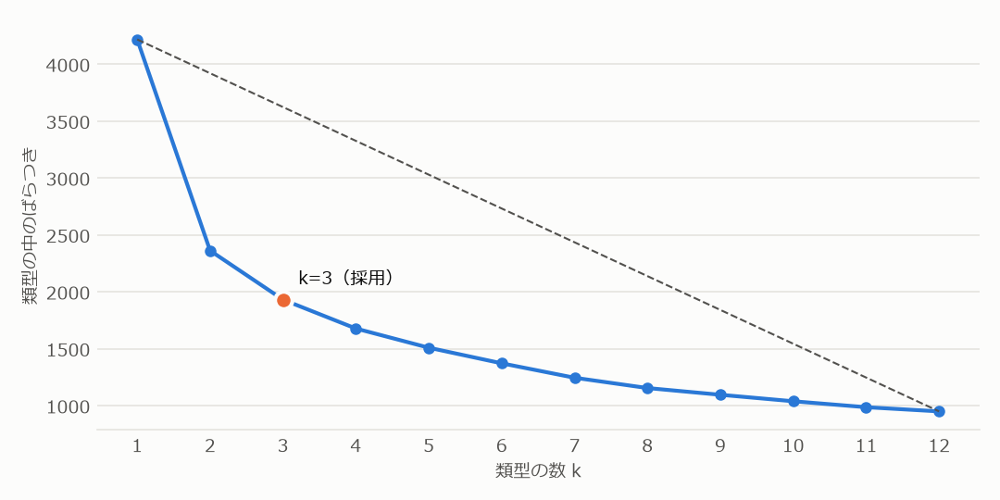
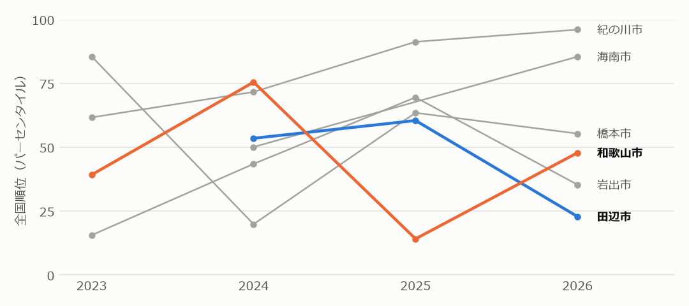
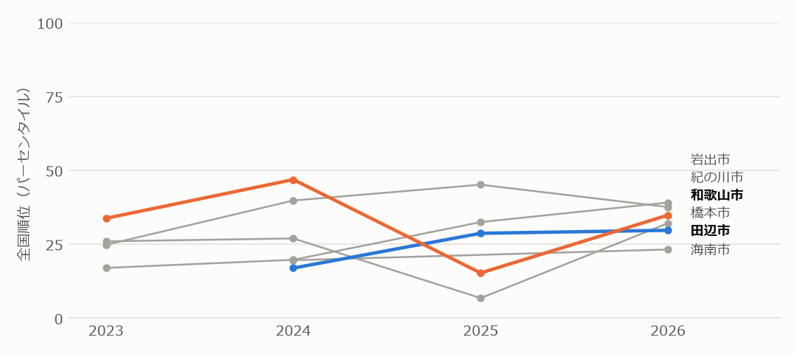
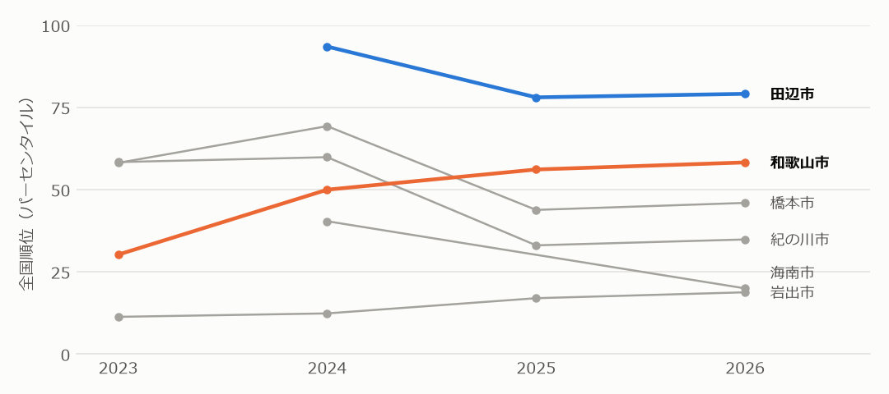
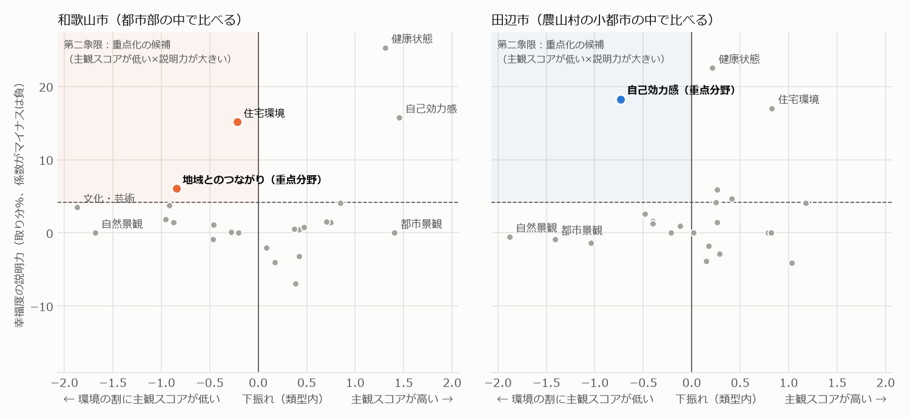
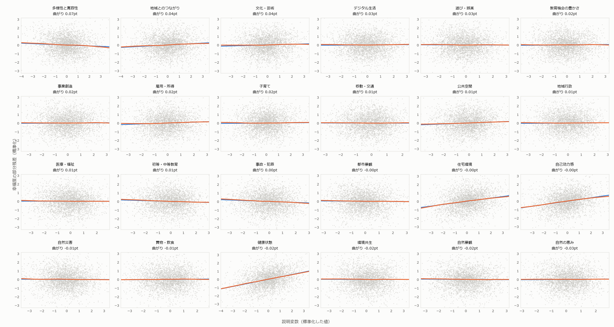
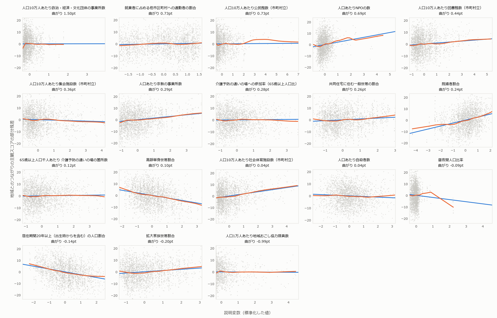
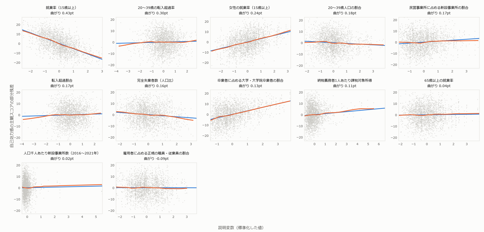

# 和歌山県 主観的ウェルビーイング分析　地域類型×個別KPI

> 数値はすべて [04_data/03_analysis/](../04_data/03_analysis/) の結果CSVから差し込んでいます（スクリプト：[05_scripts/03_analysis/](../05_scripts/03_analysis/)）。年度ごとに値がとれる数値は、幸福度データの「Y年度版」に「Y−1年（年度）」の値を対応させています（[補足1](#補足1-使ったデータと年度の扱い)）。

## アジェンダ

- はじめに：[目的](#目的) ／ [結論（目的に対する答え）](#結論目的に対する答え) ／ [分析の流れ](#分析の流れ) ／ [前処理](#前処理-分析に使うデータとその制約)
- 現状をつかむ：[ステップ0 市区町村の類型を決める](#ステップ0-市区町村の類型を決める) ／ [ステップ1 和歌山の立ち位置](#ステップ1-和歌山の立ち位置) ／ [ステップ2 ターゲットの市](#ステップ2-ターゲットの市)
- 分野を絞る：[ステップ3 幸福度を説明する分野](#ステップ3-幸福度を説明する分野) ／ [ステップ4 重点分野を決める](#ステップ4-重点分野を決める)
- 数値を探して決める：[改善候補① 主観の重点分野を個別KPIで説明できるか](#改善候補-主観の重点分野を個別kpiで説明できるか) ／ [改善候補② 追加の変数で説明できるか](#改善候補-追加の変数で説明できるか) ／ [ステップ5 因果の確認](#ステップ5-因果の確認) ／ [ステップ6 改善余地の確認と伸ばす数値](#ステップ6-改善余地の確認と伸ばす数値)
- 補足：[使ったデータと年度の扱い](#補足1-使ったデータと年度の扱い) ／ [線形モデルを使ってよいかの確認](#補足2-線形モデルを使ってよいかの確認)

## 目的

**和歌山県の住民が実際に感じている幸福度（0〜10点）を上げるために、どの市の、どの分野の、どの数値を伸ばせばよいかを特定する。**

## 結論（目的に対する答え）

**和歌山県の住民が実際に感じている幸福度を上げるためには、和歌山市の地域とのつながりで、人口10万人あたり図書館数（市町村立）・人口10万人あたり社会体育施設数（市町村立）を伸ばし、田辺市の自己効力感で、女性の就業率（15歳以上）を伸ばし、完全失業者数（人口比）を減らすべきである。**

## 分析の流れ

| 段階 | ステップ | やること |
|---|---|---|
| データの準備 | 前処理 | 回答者数・年度・地域の単位をそろえ、分析に使う全国703市町村を決める。 |
| 現状をつかむ | ステップ0 | 人口・人口密度・高齢化率・財政力指数・第1次産業割合・可住地割合で、全国の市町村を類型に分ける（エルボー法で3類型）。**以降はすべて、同じ類型の市町村と比べる。** |
|  | ステップ1 | 和歌山の6市それぞれの幸福度・主観24分野平均・客観24分野平均が、全国の中でどの水準にあるかを確かめる。 |
|  | ステップ2 | 類型の中での順位と各市の総合計画から、分析の中心にする**ターゲットの市**を決める。 |
| 分野を絞る | ステップ3 | 幸福度を主観24分野で説明するElastic Net回帰で、各分野の**説明力**を出す。 |
|  | ステップ4 | ターゲットの市ごとに、横軸＝下振れ（環境の割に主観スコアが低い度合い）、縦軸＝説明力のマトリクスを描き、**重点分野を1つ**に決める。 |
| 数値を探して決める | 改善候補① | 重点分野の主観スコアを、その分野の個別KPIで説明できるかをElastic Net回帰で確かめる（市町村×年度のデータ）。 |
|  | 改善候補② | 設問から仮説を立てて追加の変数をオープンデータから集め、入れ直して説明できるかと、効く変数を確かめる。 |
|  | ステップ5 | **因果の確認**：同じ地域の中で変数が年ごとに変わったとき、重点分野の主観スコアと幸福度も変わったかを、固定効果モデルで確かめる。 |
|  | ステップ6 | 効く変数ごとに、ターゲットの市の**伸びしろ**（同じ類型の上位4分の1までの差）を確かめ、効く・施策で動かせる・伸びしろがある変数を**伸ばす数値**にする。 |

## 前処理　分析に使うデータと、その制約

### 前.1 地域の単位

- **政令市は「○○市全域」の行を使い、区の行は使わない。** デジタル庁のデータには、政令市の区ごとの行と、市全体の「○○市全域」の行の両方が入っている。全域の行は区の回答者を合わせたものなので、両方を使うと同じ回答者を二重に数える。
- **区の行を使わないのは、比べるための数値が区ごとにないため。** 回答者数の面では、区の行も66%が5人以上を満たし、使えなくはない。しかし客観24分野のスコアは全域の行にしかなく、区の行（171区）はすべて空欄で、類型の6変数や個別KPIも政令市は市全体の値しかない。区の行では、下振れ（ステップ4）も個別KPIによる説明（改善候補①②）も計算できない。
- **東京23区は区ごとに使う。** 政令市の区と違い、23区はそれぞれが独立した自治体（特別区）で、客観スコアも個別KPIも区ごとにあるため。

### 前.2 回答者数の下限（5人以上）

- 分析の最小単位は「市区町村×年度×年代×性別」の行で、**回答者が5人以上の行だけを使う**。
- 下限を5人にした理由：
  - 1人の回答では、その人の考えが、その地域の同じ年代×性別の人たちの中でどれくらい一般的かが分からない。複数人が答えた行に絞ることで、1人の回答に引っぱられた値を除く。
  - 一方で、下限を高くするほど人口の少ない市町村や年代の行が落ち、その地域の声が分析から消えてしまう。そこで、「複数人が答えた」と言える小さい値として5人とした。

### 前.3 結果

デジタル庁ダッシュボードの主観データのうち、年代×性別の行に条件をかけて分析対象を決めた。

| 条件 | 行数 | 地域数 |
|---|---|---|
| 年代×性別の行すべて | 48,461 | 1401 |
| 2023〜26年度 | 38,365 | 1125 |
| 政令市の区を除く（政令市は市全体の1行） | 29,708 | 954 |
| 同じ年度の客観データ（24分野すべて）がある | 29,593 | 925 |
| 回答者5人以上 | 18,638 | 703 |
| うち和歌山県 | 172 | 6 |

- **和歌山県で残るのは6市**（和歌山市・田辺市・橋本市・岩出市・海南市・紀の川市、172行）。24町村は残らない。

### 前.4 結論

> 分析対象は、年代×性別の行のうち条件を満たす18,638行（703市町村）。和歌山県で使える市は、和歌山市・田辺市・橋本市・岩出市・海南市・紀の川市の6市。

スクリプト：[00_前処理.py](../05_scripts/03_analysis/00_前処理.py)　結果：[00_前処理_件数.csv](../04_data/03_analysis/00_前処理_件数.csv)

## ステップ0　市区町村の類型を決める

### 0.1 背景
人口規模や都市化の度合いが違う市町村をそのまま並べると、分野ごとの主観スコアの差の多くが「都市か地方か」で決まってしまう。

### 0.2 目的
地域の条件が似た市町村を類型にまとめ、以降のステップで「同じ類型の中で比べる」ための物差しをつくる。

### 0.3 解き方

1. **6変数をそろえる**：人口（対数）、人口密度（対数）、高齢化率、財政力指数、第1次産業就業者割合、可住地面積割合。単位が違うので、それぞれ平均0・ばらつき1に標準化する。
2. **類型の数をエルボー法で決める**：類型の数kを1〜12まで変えてk-means法で分け、それぞれ「類型の中のばらつき（クラスタ内平方和）」を計算する。kを1と12の点を結ぶ直線から最も離れた点を選ぶと、k=3になった。
3. **703市町村を3つに分ける**：k=3でk-means法をかけ、人口密度の中央値が高い順に「都市部」「地方の中心都市」「農山村の小都市」と名前を付けた。

### 0.4 この6変数を使う理由

- **暮らしの条件を6つの面から1つずつ押さえる**：規模（人口）、まとまり（人口密度）、年齢構成（高齢化率）、財政の余力（財政力指数）、産業（第1次産業就業者割合）、地形（可住地面積割合）。
- **短期には動かない条件だけを使う**：数年の施策では変わらない条件で比べる相手を決めておけば、同じ類型の中での差を「施策で埋められるかもしれない差」として読める。
- **幸福度や主観・客観スコアは入れない**：入れると「主観スコアの低い市どうし」がまとまり、比べたときの差が最初から消えてしまう（結果の先取りになる）。
- **人口と人口密度は対数にする**：大都市の値が桁違いに大きく、そのままでは少数の大都市だけで分け方が決まってしまうため。

### 0.5 結果

**エルボー法：類型の数ごとの「類型の中のばらつき」**

類型の中のばらつき（クラスタ内平方和）。オレンジの点が採用したk。破線はk=1とk=12を結ぶ直線で、この直線から最も離れた点をエルボーとして採用した。

数値を表で見る

| k | クラスタ内平方和 | 直線からの距離 | 採用 |
|---|---|---|---|
| 1 | 4218 | 0 | False |
| 2 | 2363 | 5 | False |
| 3 | 1932 | 6 | True |
| 4 | 1678 | 6 | False |
| 5 | 1509 | 5 | False |
| 6 | 1372 | 5 | False |
| 7 | 1245 | 4 | False |
| 8 | 1155 | 3 | False |
| 9 | 1096 | 3 | False |
| 10 | 1039 | 2 | False |
| 11 | 987 | 1 | False |
| 12 | 950 | 0 | False |

**和歌山の6市が入る類型**

- **都市部**（268市町村）：和歌山市
- **地方の中心都市**（280市町村）：橋本市・岩出市
- **農山村の小都市**（155市町村）：海南市・田辺市・紀の川市

**和歌山の6市の類型と、類型を決めた6変数**

| 市 | 類型 | 類型の市町村数（うち近畿） | 人口 | 人口密度（人/km²） | 高齢化率 | 財政力指数 | 第1次産業 | 可住地 | 県内の同じ類型 |
|---|---|---|---|---|---|---|---|---|---|
| **和歌山市** | 都市部 | 268（49） | 35.7万人 | 1,708 | 31.1% | 0.77 | 1.7% | 69% | なし |
| **田辺市** | 農山村の小都市 | 155（13） | 7.0万人 | 68 | 34.6% | 0.39 | 11.3% | 12% | 海南市・紀の川市 |
| **橋本市** | 地方の中心都市 | 280（42） | 6.1万人 | 466 | 34.8% | 0.45 | 5.8% | 44% | 岩出市 |
| **岩出市** | 地方の中心都市 | 280（42） | 5.4万人 | 1,401 | 24.9% | 0.61 | 3.1% | 62% | 橋本市 |
| **海南市** | 農山村の小都市 | 155（13） | 4.8万人 | 479 | 37.8% | 0.51 | 8.8% | 62% | 田辺市・紀の川市 |
| **紀の川市** | 農山村の小都市 | 155（13） | 5.9万人 | 258 | 34.0% | 0.41 | 16.7% | 54% | 海南市・田辺市 |

**構造が最も近い市町村（6変数が近い順に8つ）**

| 市 | 構造が近い市町村（近い順） |
|---|---|
| **和歌山市** | 岐阜県岐阜市、香川県高松市、徳島県徳島市、神奈川県横須賀市、岡山県倉敷市、兵庫県加古川市、群馬県前橋市、愛媛県松山市 |
| **田辺市** | 大分県日田市、青森県十和田市、広島県三次市、岐阜県高山市、新潟県南魚沼市、群馬県沼田市、秋田県由利本荘市、岩手県花巻市 |
| **橋本市** | 長野県千曲市、佐賀県武雄市、群馬県渋川市、新潟県新発田市、茨城県笠間市、山口県山陽小野田市、静岡県伊豆の国市、茨城県石岡市 |
| **岩出市** | 京都府木津川市、山梨県甲斐市、福岡県福津市、石川県能美市、福岡県古賀市、奈良県天理市、福井県鯖江市、長崎県長与町 |
| **海南市** | 千葉県館山市、香川県三豊市、千葉県山武市、徳島県鳴門市、茨城県桜川市、新潟県阿賀野市、岡山県瀬戸内市、福島県二本松市 |
| **紀の川市** | 熊本県菊池市、熊本県宇城市、山梨県笛吹市、兵庫県淡路市、長崎県島原市、福岡県八女市、熊本県山鹿市、福岡県朝倉市 |

### 0.6 結論

> 全国703市町村は、人口が多く住宅が密集し財政力の高い「都市部」（268市町村）、中規模で人口密度がほどほどの「地方の中心都市」（280市町村）、人口が少なく高齢化と第1次産業の割合が高い「農山村の小都市」（155市町村）の3類型に分けられた。和歌山の6市は、和歌山市が都市部、橋本市・岩出市が地方の中心都市、田辺市・海南市・紀の川市が農山村の小都市に分類された。

スクリプト：[01_ステップ0_類型.py](../05_scripts/03_analysis/01_ステップ0_類型.py)　結果：[01_類型.csv](../04_data/03_analysis/01_類型.csv)・[01_エルボー.csv](../04_data/03_analysis/01_エルボー.csv)・[01_近い市町村.csv](../04_data/03_analysis/01_近い市町村.csv)

## ステップ1　和歌山の立ち位置

### 1.1 背景
和歌山県の暮らしの主観スコアが低いと言われているが、全国の中での具体的な位置や、年ごとの変化を数字で確認できていない。

### 1.2 目的
和歌山県の、全国の中での立ち位置を数字で押さえる。

### 1.3 解き方
**市ごとの全国順位**：幸福度・主観24分野の平均・客観24分野の平均それぞれについて、6市ごとに、同じ年度にデータがある市町村全体の中での順位（パーセンタイル）を年度ごとに出す。6市を1つの値にまとめず、市ごとに見る。幸福度と主観は年代×性別の構成をそろえた値を使う。

### 1.4 結果

順位は、その年度にデータがある市町村全体の中で、低いほうから数えた位置を0〜100のパーセンタイルで表したもの（0に近いほど低い）。年度によってデータがある市町村の数が違う（2023年度424・2024年度679・2025年度530・2026年度586）ため、パーセンタイルで比べる。データがない年度（回答者数が少なく分析対象から外れた年度）は点がない。

**幸福度の全国順位（パーセンタイル）の推移**

数値を表で見る

| 市 | 2023年度 | 2024年度 | 2025年度 | 2026年度 |
|---|---|---|---|---|
| 和歌山市 | 39 | 76 | 14 | 48 |
| 田辺市 |  | 54 | 60 | 23 |
| 橋本市 | 86 | 20 | 64 | 55 |
| 岩出市 | 16 | 44 | 70 | 35 |
| 海南市 |  | 50 |  | 85 |
| 紀の川市 | 62 | 72 | 91 | 96 |

**主観24分野平均の全国順位（パーセンタイル）の推移**

数値を表で見る

| 市 | 2023年度 | 2024年度 | 2025年度 | 2026年度 |
|---|---|---|---|---|
| 和歌山市 | 34 | 47 | 15 | 35 |
| 田辺市 |  | 17 | 29 | 30 |
| 橋本市 | 26 | 27 | 7 | 32 |
| 岩出市 | 17 | 20 | 33 | 39 |
| 海南市 |  | 20 |  | 23 |
| 紀の川市 | 25 | 40 | 45 | 38 |

**客観24分野平均の全国順位（パーセンタイル）の推移**

数値を表で見る

| 市 | 2023年度 | 2024年度 | 2025年度 | 2026年度 |
|---|---|---|---|---|
| 和歌山市 | 30 | 50 | 56 | 58 |
| 田辺市 |  | 94 | 78 | 79 |
| 橋本市 | 58 | 69 | 44 | 46 |
| 岩出市 | 11 | 12 | 17 | 19 |
| 海南市 |  | 40 |  | 20 |
| 紀の川市 | 58 | 60 | 33 | 35 |

- 幸福度や客観24分野の平均は、市や年度によって高い位置（上位30〜90%台）に来ることも多い。これに対し**主観24分野の平均は、6市とも、ほとんどの年度で下位50%以内（低いほう）にとどまる**。
- 特に橋本市（2025年度：下から7%）、和歌山市（2025年度：下から15%）、田辺市（2024年度：下から17%）、岩出市（2023年度：下から17%）は、その年度の全市町村の中でも下位2割に入るほど低い。

### 1.5 結論

> 和歌山県の6市は、幸福度や客観24分野の平均では全国の中で高い位置に来る市・年度も多いが、主観24分野の平均だけは、どの市もほとんどの年度で下位50%以内にとどまる。この低さは特定の1市・1年度に限らず、6市に共通して続いている。

スクリプト：[02_ステップ1_立ち位置.py](../05_scripts/03_analysis/02_ステップ1_立ち位置.py)　結果：[02_全国順位.csv](../04_data/03_analysis/02_全国順位.csv)

## ステップ2　ターゲットの市

### 2.1 背景
ステップ1で、6市それぞれの全国順位を市ごとに確認した。しかし、この先の分野ごとの深掘りや個別KPIとの関係の分析まで6市すべてを同じ深さで調べるのは難しい。どの市を重点的に調べるか、再現性のあるルールで2市に絞り込む必要がある。

### 2.2 目的
分析の中心に据えるターゲットの市を決める。

### 2.3 解き方

次の3つの条件のうち、満たす数でターゲットの市を決める。

1. **条件1 広く弱い**：幸福度と主観24分野の平均が、どちらも同じ類型の中央値より低い。
2. **条件2 特定の分野だけ弱い**：24分野のうち最も順位が低い分野が、同じ類型の下位5%以内。
3. **条件3 総合計画に明記**：条件1か2に当たる市について、その弱さに対応する課題が総合計画（現行計画と、公表されていれば次期計画の案）に書かれている。条件1・2のどちらにも当たらない市は、弱い分野がないため確かめない。
4. **絞り込み**：満たす条件の数が多い順に並べ、同数なら、最も低い分野の類型内の位置（順位 ÷ 類型の市町村数）が低い順にする。上位2市をターゲット（1位＝主、2位＝副）とする。

### 2.4 結果

値は2023〜26年度をまとめた、年代×性別の構成をそろえた値。順位は低いほうから数えた順位／同じ類型の市町村数。並びは絞り込みの順。

| 市 | 類型 | 幸福度（類型内順位） | 主観24分野平均（類型内順位） | 最も低い分野（類型内順位） | 条件1 広く弱い（幸福度・主観24分野平均がどちらも類型の中央値より低い） | 条件2 特定の分野だけ弱い（最も低い分野が類型の下位5%以内） | 条件3 総合計画に明記（弱さに対応する課題が総合計画にある） | 満たす条件の数 | 判定 |
|---|---|---|---|---|---|---|---|---|---|
| 和歌山市 | 都市部 | 6.40（81／268） | 43.1（39／268） | デジタル生活、雇用・所得、事業創造（6／268） | ● | ● | ● | 3 | **主ターゲット** |
| 田辺市 | 農山村の小都市 | 6.39（91／155） | 41.3（100／155） | 自己効力感（5／155） | — | ● | ● | 2 | **副ターゲット** |
| 橋本市 | 地方の中心都市 | 6.47（173／280） | 40.7（64／280） | 雇用・所得（12／280） | — | ● | ● | 2 | 対象外 |
| 岩出市 | 地方の中心都市 | 6.37（111／280） | 41.8（83／280） | 環境共生（35／280） | ● | — | — | 1 | 対象外 |
| 海南市 | 農山村の小都市 | 6.57（122／155） | 40.3（87／155） | 自然景観（15／155） | — | — | （確かめない） | 0 | 対象外 |
| 紀の川市 | 農山村の小都市 | 6.68（135／155） | 43.8（124／155） | 都市景観（58／155） | — | — | （確かめない） | 0 | 対象外 |

### 2.5 根拠

- **和歌山市（主ターゲット）**：3条件すべてを満たす唯一の市。
  - 条件1 広く弱い（幸福度・主観24分野平均がどちらも類型の中央値より低い）：幸福度81位・主観24分野平均39位／268
  - 条件2 特定の分野だけ弱い（最も低い分野が類型の下位5%以内）：デジタル生活、雇用・所得、事業創造6位／268、下位2.2%
  - 条件3 総合計画に明記：総合計画が「開業率の低さ（事業創造）、女性・高齢者の就業率の低さ（雇用・所得）」を課題に挙げている
- **田辺市（副ターゲット）**：条件2・3の2つを満たす。幸福度・主観24分野平均は類型の中で中位以上で、低さが1分野に集中している。
  - 条件2 特定の分野だけ弱い：自己効力感5位／155、下位3.2%
  - 条件3 総合計画に明記：総合計画が「若者が市外へ転出した後、地元へ戻らない傾向」を課題に挙げている
- **橋本市（対象外）**：田辺市と同じ条件2・3の2つを満たす（特定の分野だけ弱い：雇用・所得12位／280、下位4.3%）。同数のため最も低い分野の位置で比べると、田辺市（下位3.2%）のほうが低く、橋本市は3位。
- **岩出市（対象外）**：条件1 広く弱いだけ（幸福度111位・主観24分野平均83位／280）。総合計画は転入超過が続く前提で、幸福度・主観スコアの低さに対応する課題を挙げていない。
- **海南市・紀の川市（対象外）**：条件0。幸福度・主観24分野平均は類型の中央値以上で、最も低い分野も下位5%に入らない（自然景観15位／155、下位9.7%／都市景観58位／155、下位37.4%）。

注意：田辺市の第3次総合計画 基本構想（案）PDF p8は、市が独自に行ったアンケート（R7.9）で「自己効力感」を偏差値が高い領域としている。本分析（デジタル庁の全国調査を、同じ類型の中で比べた値）とは、データも比べる相手も違う。

総合計画の原文とページ

- **和歌山市**：第5次長期総合計画 PDF p56に「本市は、開業率と廃業率がともに全国平均より低く、産業の新陳代謝が進みにくい状況にあります」（事業創造）、PDF p58に「女性及び高齢者の就業率、女性の正規雇用率が低い状況」（雇用・所得）。PDF p101に「近年、自治会への加入者数が減少するなど人と人とのつながりは希薄化しています」。自治会加入率は80.3%（H27）→73.1%（R5）と目標85.0%から逆行（実施計画R6〜R8 PDF p134）
- **田辺市**：基本理念は「一人ひとりが大切にされ、幸せを実感できるまちづくり」。第3次総合計画 基本構想（案）（R8.7）PDF p7に「高校卒業後、進学や就職のため、市外へ転出した後、地元へ戻らない傾向が続いており」「町内会加入率の低下などによる地域コミュニティの希薄化」
- **橋本市**：第2次長期総合計画 後期基本計画 PDF p23に「『雇用、就労、労働環境の整備』…は満足度が低い一方で重要度が高くなっているため、重点的な対応が必要」
- **岩出市**：第3次長期総合計画 後期基本計画（R8.3策定）は転入超過が続いていることを前提にしており、若者の転出も課題にしていない

総合計画の原文・計画期間は [総合計画_要点.md](../02_memo/総合計画_要点.md)、PDFは [04_data/01_raw/13_総合計画/](../04_data/01_raw/13_総合計画/)（取得：[13_総合計画.py](../05_scripts/01_download/13_総合計画.py)）。総合計画の照合はスクリプトでは再現できないため、[03_ステップ2_ターゲット.py](../05_scripts/03_analysis/03_ステップ2_ターゲット.py) の `PLAN` に手入力している。

### 2.6 結論

> ターゲットは和歌山市（主）と田辺市（副）の2市。和歌山市は、広く弱い・特定の分野だけ弱い・総合計画に明記の3条件をすべて満たす唯一の市。田辺市は、自己効力感だけが類型の下位3.2%と低く、総合計画にも対応する課題がある2条件の市で、同じ2条件の橋本市より最も低い分野の位置が低い。

スクリプト：[03_ステップ2_ターゲット.py](../05_scripts/03_analysis/03_ステップ2_ターゲット.py)　結果：[03_6市の判定.csv](../04_data/03_analysis/03_6市の判定.csv)

## ステップ3　幸福度を説明する分野

### 3.1 背景
ターゲットの市について、主観的ウェルビーイングを構成する24分野すべてを同時に向上させるのは難しい。どの分野の主観スコアが幸福度とつながっているかを知る必要がある。

### 3.2 目的
幸福度を主観24分野で説明し、各分野の説明力（幸福度への効き方の大きさ）を出す。ターゲットの市が入る類型ごとにも出す。

### 3.3 解き方

1. **比べる土台をそろえる**：各行（市町村×年度×年代×性別、18,638行）の幸福度と主観24分野から、同じ類型・年度・年代・性別の平均（回答者数で重みづけ）を引く。
2. **標準化**：幸福度と主観24分野を、それぞれ平均0・ばらつき1にそろえる。
3. **Elastic Net回帰**：幸福度 = Σ β分野 × 主観分野 を、回答者数で重みづけして推定する。普通の重回帰（最小二乗法）に、係数の大きさへの罰則（L1＝Lasso：効かない分野の係数を0にする、L2＝Ridge：似た分野どうしで係数を分け合う）を加えたもの。
4. **罰則の強さを交差検証で決める**：罰則の強さ（alpha）とL1の割合（l1_ratio：0.1〜1.0の7通り）を、市町村単位の5分割交差検証（GroupKFold）で、テスト側の当てはまりが最もよい組に決める。
5. **説明力の取り分**：各分野の係数の絶対値を、全分野の合計が100%になる割合にする。係数がマイナスの分野（主観スコアが高いほど幸福度が低い）は、ステップ4ではマイナスの取り分として扱う。
6. **LMGで確かめる**：普通の重回帰の説明力（R²）を、分野を足す順番を1,500通り変えて分け合う相対重要度分析（LMG）でも取り分を出し、Elastic Netの取り分との順位相関（スピアマン）を見る。
7. **類型ごとにも計算する**：都市部（和歌山市の類型）と農山村の小都市（田辺市の類型）の行だけでも、同じ計算をする。

### 3.4 この方法を使う理由

- **平均を引いて比べる土台をそろえる**：幸福度も主観スコアも、都市か地方か・年代・性別で水準が違う。そのまま回帰すると、分野の効き方ではなく「この属性の人は両方高い」という差を拾ってしまうため、同じ条件の人たちの中で主観スコアが高い人ほど幸福度も高いかだけを見る。
- **標準化する**：分野ごとに点数のばらつきが違うため、そろえないと係数の大きさを分野どうしで比べられない。
- **回答者数で重みづける**：回答者が多い行ほど平均の揺れが小さく、値を信頼できるため。
- **普通の重回帰ではなくElastic Netを使う**：主観24分野は互いの相関が強く（多重共線性）、普通の重回帰では係数の大きさや向きが、データの少しの違いで大きく変わる。Lasso（L1）だけでは似た分野のどちらか一方だけが残り、Ridge（L2）だけでは効かない分野の係数が0にならない。両方を組み合わせて、効かない分野を0にしつつ、似た分野で係数を分け合う。
- **市町村単位で交差検証する**：同じ市町村の別年度・別の年代×性別は値が似ている。学習とテストにまたがると、当てはまりを高く見積もってしまう。
- **取り分（%）にする**：合計100%の割合にすると、分野どうしを比べやすく、ステップ4の基準線（24分野の均等割り 100÷24）とも比べられる。
- **LMGで確かめる**：Elastic Netの取り分は、罰則の強さによって変わりうる。罰則を使わない別の方法でも同じ並びになれば、結果は手法によらないと言える。取り分の値ではなく並びが合うかを見たいので、順位相関で比べる。
- **線形モデルでよいかを確かめる**：Elastic Netは、主観スコアと幸福度の関係を直線とみなす。曲線や分野の組み合わせを取り込める非線形モデルと説明力を比べ、線形で足りることを確かめた（[補足2](#補足2-線形モデルを使ってよいかの確認)）。
- **類型ごとにも計算する**：都市部と農山村の小都市で、幸福度に効く分野が違う可能性があるため。

### 3.5 結果

**幸福度の説明力のうち、各分野の取り分（上位8分野）**

| 分野 | 類型を揃えた全国 | 都市部（和歌山市の類型） | 農山村の小都市（田辺市の類型） |
|---|---|---|---|
| 交差検証R²（説明力） | 0.37（18,638行） | 0.38（8,541行） | 0.36（2,745行） |
| LMGとの順位相関 | 0.79 | 0.55 | 0.64 |
| 健康状態 | **28%** 1位 | 25% 1位 | 23% 1位 |
| 自己効力感 | **19%** 2位 | 16% 2位 | 18% 2位 |
| 住宅環境 | **18%** 3位 | 15% 3位 | 17% 3位 |
| 地域とのつながり | **6%** 4位 | 6% 5位 | 6% 4位 |
| 公共空間 | **5%** 5位 | 4% 6位 | 4% 8位 |
| 事故・犯罪 | **5%** 6位 | 7% 4位 | 4% 7位 |
| 雇用・所得 | **4%** 7位 | 4% 8位 | 0% 20位 |
| 多様性と寛容性 | **4%** 8位 | 3% 10位 | 4% 9位 |

交差検証R²は、学習に使っていない市町村の幸福度の差を主観24分野でどれだけ当てられるか（0.36〜0.38）。選ばれた罰則は、類型を揃えた全国でalpha=0.003・l1_ratio=1.0、都市部でalpha=0.006・l1_ratio=0.3、農山村の小都市でalpha=0.047・l1_ratio=0.1。

- **健康状態・自己効力感・住宅環境の上位3分野は、どの類型でも同じ**で、3分野で説明力の7割強（類型を揃えた全国で28%・19%・18%）を占める。
- 4位以下は取り分が数%ずつで、上位3分野とは大きな開きがある。地域とのつながりは都市部で6%（5位）、農山村の小都市で6%（4位）。
- 相対重要度分析（LMG）との順位相関は0.55〜0.79で、上位の並びは手法によらない。

### 3.6 結論

> 幸福度を最も説明するのは、健康状態・自己効力感・住宅環境の主観スコアで、3分野で説明力の7割強を占める。この並びは都市部でも農山村の小都市でも変わらない。

スクリプト：[04_ステップ3_寄与度.py](../05_scripts/03_analysis/04_ステップ3_寄与度.py)　結果：[04_寄与度.csv](../04_data/03_analysis/04_寄与度.csv)・[04_モデル.csv](../04_data/03_analysis/04_モデル.csv)

## ステップ4　重点分野を決める

### 4.1 背景
幸福度を説明する分野でも、ターゲットの市の主観スコアがすでに十分なら上げる余地は小さい。説明力（ステップ3）と、その市の主観スコアの低さを合わせて、1つの分野に絞る必要がある。

### 4.2 目的
ターゲットの市ごとに、主観スコアを上げる**重点分野を1つ**決める。

### 4.3 解き方

1. **下振れを出す**：行ごとに主観24分野と客観24分野をそれぞれ平均0・ばらつき1にそろえ、分野ごとに「主観−客観」を出す。同じ類型・年度・年代・性別の平均を引き、市町村ごとに回答者数で平均する。マイナスは、同じ類型の市町村と比べて、環境（客観）の割に主観スコア（主観）が低い分野。
2. **マトリクスを描く**：横軸＝下振れ、縦軸＝説明力（ステップ3の、その市の類型の取り分%。係数がマイナスの分野はマイナス）。
3. **第二象限を重点化の候補にする**：下振れ＜0（環境の割に主観スコアが低い）かつ説明力＞4.17%（24分野の均等割り 100÷24）の分野。
4. **1つに絞る式**：第二象限の分野について、**重点度 ＝ 説明力（取り分%）×（−下振れ）** を計算し、最大の分野を重点分野にする。重点度は「幸福度に効く度合い」と「環境の割に主観スコアが足りない度合い」の積で、どちらか一方が小さければ小さくなる。

### 4.4 結果

点は24分野。色付きの点が第二象限の分野、太字が重点分野。破線は説明力の基準線（均等割り）。

**第二象限の分野と重点度**

| 市 | 分野 | 下振れ（類型内順位） | 説明力 | 重点度 |
|---|---|---|---|---|
| 和歌山市 | **地域とのつながり** | −0.84（11／268） | 6.0% | 5.10 |
| 和歌山市 | 住宅環境 | −0.22（161／268） | 15.2% | 3.27 |
| 田辺市 | **自己効力感** | −0.73（30／155） | 18.3% | 13.38 |

- **和歌山市**：第二象限は住宅環境・地域とのつながり。住宅環境は説明力は大きいが下振れが小さく（−0.22）、重点度（3.27）が下回る。重点度が最大の**地域とのつながり**（下振れ−0.84、都市部で11番目）を重点分野とする。
- **田辺市**：第二象限は自己効力感だけで、**自己効力感**（下振れ−0.73、説明力18%）を重点分野とする。
- 下振れが大きくても説明力が基準線より小さい分野（和歌山市の文化・芸術・自然景観、田辺市の自然景観・都市景観など）は、主観スコアを上げても幸福度にはほとんど効かないため、重点分野にしない。

### 4.5 結論

> 重点分野は、和歌山市が「地域とのつながり」、田辺市が「自己効力感」。どちらも幸福度の説明力が均等割りを上回り、同じ類型の中で環境の割に主観スコアが低い。以降はこの2つの組（和歌山市×地域とのつながり、田辺市×自己効力感）だけを分析する。

スクリプト：[05_ステップ4_下振れ.py](../05_scripts/03_analysis/05_ステップ4_下振れ.py)　結果：[05_重点分野マトリクス.csv](../04_data/03_analysis/05_重点分野マトリクス.csv)・[05_下振れ.csv](../04_data/03_analysis/05_下振れ.csv)

## 改善候補①　主観の重点分野を個別KPIで説明できるか

### 4A.1 背景
主観の重点分野のスコアが、その分野の個別KPI（ダッシュボードが客観スコアの計算に使う統計の数値）で説明できるなら、その中から伸ばす数値を選べる。説明できないなら、ほかの変数を探す必要がある。

### 4A.2 目的
重点分野の主観スコアを、その分野の個別KPIでどれだけ説明できるかを確かめる。

### 4A.3 解き方

1. **データ（市町村×年度）**：1行＝1市町村の1年度（年度版2023〜26、2,219行・703市町村）。
   - 目的変数：重点分野の主観スコア（年代×性別の構成をそろえた値）。
   - 個別KPI：年度ごとに値があるもの（NPOの数・自殺者数・転入超過割合、2022〜2025年）は、その年度版に対応する年（Y−1年）の値。1時点しかないもの（2020年・2021年）は、どの年度も同じ値。
   - 重み：その市町村・年度の回答者数。
2. **2つのモデルを比べる**（回帰はステップ3と同じElastic Net。説明変数はすべて平均0・ばらつき1に標準化）：
   - 土台：類型（ダミー）＋類型の6変数（人口・人口密度は対数）＋年度（ダミー）。
   - 土台＋その分野の個別KPI。
3. **説明力**：学習に使っていない市町村の主観スコアをどれだけ当てられるか（交差検証R²）。市町村単位の5分割交差検証（GroupKFold）を分割の乱数5通りで行い、予測を平均して計算する。
4. **判定**：個別KPIを加えたときの交差検証R²の上乗せについて、95%信頼区間を出す（市町村を復元抽出するブートストラップ、2,000回）。下限が0を超えれば「個別KPIで説明できる」。
5. **効いた個別KPI**：市町村を復元抽出して200回学習し直し、想定どおりの向きの係数が出た割合が90%以上のもの。

### 4A.4 この方法を使う理由

- **土台と比べる**：重点分野の主観スコアは、都市規模や年度の違いだけでもある程度説明できる。土台への上乗せを見れば、個別KPIそのものの説明力がわかる。
- **閾値ではなく信頼区間で判定する**：「上乗せ10ポイント以上」のような閾値には統計的な根拠がなく、閾値を変えると結論が変わりうる。上乗せが偶然の範囲を超えているか（信頼区間が0を含まないか）で判定すれば、閾値を置かずに済む。
- **市町村単位で復元抽出する**：同じ市町村の年度どうしは値が似ているため、行を独立に扱うと信頼区間が狭くなりすぎる。
- **効いたかを向きの安定で見る**：Elastic Netは係数のp値を出せないため、学習し直しても同じ向きの係数が出るかで判断する。
- **線形モデルでよいかを確かめる**：変数と主観スコアの関係が曲がっていないか、非線形モデルと説明力を比べて確かめた（[補足2](#補足2-線形モデルを使ってよいかの確認)。改善候補②も同じ）。

### 4A.5 結果

**重点分野の主観スコアの説明力（交差検証R²）**

| 市 × 重点分野 | 土台 | 土台＋個別KPI | 上乗せ［95%信頼区間］ | p値（片側） | 判定 |
|---|---|---|---|---|---|
| 和歌山市 × 地域とのつながり | 6.6% | 12.0% | +5.4 [−4.2, +11.7] | 0.114 | 個別KPIでは説明できない |
| 田辺市 × 自己効力感 | 41.3% | 44.0% | +2.7 [+1.1, +4.3] | 0.001 | 個別KPIで説明できる |

**地域とのつながりの個別KPI（係数＝1標準偏差あたりの主観スコアの差）**

| 個別KPI | 係数 | 想定どおりの向きの割合 | 効いた | 施策で動かせるか | データの期間 |
|---|---|---|---|---|---|
| 既婚者割合 | +2.42 | 100% | ● | 動かせない | 2020年 |
| 高齢単身世帯割合 | −1.88 | 99% | ● | 動かせない | 2020年 |
| 人口あたり宗教の事業所数 | +1.21 | 100% | ● | 動かせない | 2021年 |
| 人口あたりNPOの数 | +0.73 | 100% | ● | 動かせる | 2022〜2025年 |
| 人口あたり自殺者数 | −0.46 | 100% | ● | 動かせない | 2022〜2025年 |
| 拡大家族世帯割合 | +0.24 | 62% | — | 動かせない | 2020年 |

**自己効力感の個別KPI（係数＝1標準偏差あたりの主観スコアの差）**

| 個別KPI | 係数 | 想定どおりの向きの割合 | 効いた | 施策で動かせるか | データの期間 |
|---|---|---|---|---|---|
| 転入超過割合 | +0.50 | 94% | ● | 動かせない | 2022〜2025年 |
| 完全失業者数（人口比） | −1.90 | 100% | ● | 動かせる | 2020年 |

- **和歌山市 × 地域とのつながり**：土台だけでは7%しか説明できず、個別KPIを入れると12%（+5.4、95%信頼区間−4.2〜+11.7）。効いた個別KPIは多いが、ほとんどが既婚者割合・高齢単身世帯割合など、施策で動かしにくい人口構造の数値。
- **田辺市 × 自己効力感**：土台で41%説明でき（類型の差が大きい）、個別KPIの上乗せは+2.7（95%信頼区間+1.1〜+4.3）。個別KPIは転入超過割合と完全失業者数の2本しかない。

### 4A.6 結論

> 和歌山市×地域とのつながりは個別KPIによる上乗せが+5.4（95%信頼区間−4.2〜+11.7）で、個別KPIでは説明できない。田辺市×自己効力感は個別KPIによる上乗せが+2.7（95%信頼区間+1.1〜+4.3）で、個別KPIで説明できる。個別KPIで説明できない分野は追加の変数を探し、説明できる分野も、上乗せが小さく施策で動かせる個別KPIが限られるため、追加の変数で説明がさらに伸びるかを確かめる（改善候補②）。

スクリプト：[06_改善候補1_個別KPIで説明.py](../05_scripts/03_analysis/06_改善候補1_個別KPIで説明.py)（回帰の方法：[explain.py](../05_scripts/03_analysis/explain.py)）　結果：[06_説明力.csv](../04_data/03_analysis/06_説明力.csv)・[06_個別KPIの係数.csv](../04_data/03_analysis/06_個別KPIの係数.csv)

## 改善候補②　追加の変数で説明できるか

### 4B.1 背景
改善候補①で、地域とのつながりは個別KPIの上乗せが+5.4（個別KPIでは説明できない）、自己効力感は個別KPIの上乗せが+2.7（個別KPIで説明できる）だった。個別KPIだけでは説明が足りないか、施策で動かせる個別KPIが限られる。ダッシュボードの個別KPIには、自治会加入率・祭りの数・投票率なども含まれるが、全国の市町村をそろえて集められる公的データがない（ダッシュボードの値は利用規約で機械的な取得が禁止されている）。そこで、重点分野の設問から仮説を立て、公的なオープンデータから説明できそうな変数を集め直す。

### 4B.2 目的
追加の変数を入れて、重点分野の主観スコアを説明できるかと、どの変数が効くかを確かめる。

### 4B.3 解き方

1. **仮説を立てる**：重点分野の設問と総合計画の課題から、主観スコアに関わりそうな変数を考える（下表の「仮説」）。
   - 地域とのつながりの設問：町内の人を信頼している／コミュニティ活動への市民参加が盛ん／困ったときに相談できる人がいる／町内の人を手助けする／町内に愛着がある
   - 自己効力感の設問：自分のことを好ましく感じる
2. **変数を集める**：全国の市町村をそろえて取れる公的データ（国勢調査、統計でみる市区町村のすがた、経済センサス、公共施設状況調、厚生労働省、総務省）から作る。
3. **3つのモデルを比べる**（回帰の方法は改善候補①と同じ。追加の変数までそろう同じ行で比べる）：
   - 土台
   - 土台＋個別KPI
   - 土台＋個別KPI＋追加の変数（最終モデル）
4. **判定**：最終モデルの、土台からの上乗せの95%信頼区間の下限が0を超えれば「説明できる」。追加の変数そのものの効果は、個別KPIのモデルからの上乗せで同じように確かめる。
5. **効いた変数**：最終モデルで、想定どおりの向きの係数が出た割合が90%以上の変数。

**追加した変数と仮説**

| 分野 | 変数 | 仮説 | 出典 | データの期間 |
|---|---|---|---|---|
| 地域とのつながり | 居住期間20年以上（出生時からを含む）の人口割合 | 長く住む人が多いほど、顔見知りが増え愛着が育つ | 総務省統計局「令和2年国勢調査」 移動人口 第8-1表 | 2020年 |
| 地域とのつながり | 共同住宅に住む一般世帯の割合 | 集合住宅は近所づきあいが生まれにくい | 総務省統計局「令和2年国勢調査」 人口等基本集計 第19-4表 | 2020年 |
| 自己効力感 | 就業率（15歳以上） | 働いて役割を持てているほど、自分を肯定しやすい | 総務省統計局「令和2年国勢調査」 就業状態等基本集計 第1-2表 | 2020年 |
| 自己効力感 | 女性の就業率（15歳以上） | 女性が働き役割を持てている | 総務省統計局「令和2年国勢調査」 就業状態等基本集計 第1-2表 | 2020年 |
| 自己効力感 | 65歳以上の就業率 | 高齢者が働き役割を持てている | 総務省統計局「令和2年国勢調査」 就業状態等基本集計 第1-2表 | 2020年 |
| 自己効力感 | 雇用者に占める正規の職員・従業員の割合 | 安定した働き方ができている | 総務省統計局「令和2年国勢調査」 就業状態等基本集計 第3-2表 | 2020年 |
| 自己効力感 | 卒業者に占める大学・大学院卒業者の割合 | 学歴・学びの機会 | 総務省統計局「令和2年国勢調査」 就業状態等基本集計 第11-2表 | 2020年 |
| 地域とのつながり | 昼夜間人口比率 | 昼間も地域にいる人が多いほど、地域の活動に参加しやすい | 総務省統計局「統計でみる市区町村のすがた」2026 A 人口・世帯 | 2020年 |
| 地域とのつながり | 就業者に占める他市区町村への通勤者の割合 | 市外で働く人が多いほど、地域で過ごす時間が短い | 総務省統計局「統計でみる市区町村のすがた」2026 F 労働 | 2020年 |
| 自己効力感 | 納税義務者1人あたり課税対象所得 | 所得の高さ | 総務省統計局「統計でみる市区町村のすがた」2024・2025・2026 C 経済基盤 | 2022〜2024年 |
| 自己効力感 | 20〜39歳人口の割合 | 若い世代が多いほど、地域に活気と将来像がある | 総務省「住民基本台帳に基づく人口、人口動態及び世帯数調査」 | 2022〜2025年 |
| 自己効力感 | 20〜39歳の転入超過率 | 若い世代が出ていかない（総合計画が挙げる若者の転出） | 総務省統計局「住民基本台帳人口移動報告」年報 表11-3 | 2022〜2025年 |
| 地域とのつながり | 人口10万人あたり政治・経済・文化団体の事業所数 | 団体（町内会以外の地縁・文化団体など）が多いほど、参加の場がある | 令和3年経済センサス‐活動調査 第9-1A表 | 2021年 |
| 自己効力感 | 人口千人あたり新設事業所数（2016〜2021年） | 新しく事業を始める人がいる（挑戦できる地域） | 令和3年経済センサス‐活動調査 第30表 | 2021年（2016〜2021年の新設） |
| 自己効力感 | 民営事業所に占める新設事業所の割合 | 新しい事業所が多い（挑戦できる地域） | 令和3年経済センサス‐活動調査 第30表 | 2021年（2016〜2021年の新設） |
| 地域とのつながり | 人口10万人あたり公民館数（市町村立） | 住民が集まり活動する場 | 総務省「公共施設状況調経年比較表」市町村経年比較表 | 2022〜2024年度 |
| 地域とのつながり | 人口10万人あたり図書館数（市町村立） | 学びや交流の場 | 総務省「公共施設状況調経年比較表」市町村経年比較表 | 2022〜2024年度 |
| 地域とのつながり | 人口10万人あたり社会体育施設数（市町村立） | スポーツを通じて住民が集まる場 | 総務省「公共施設状況調経年比較表」市町村経年比較表 | 2022〜2024年度 |
| 地域とのつながり | 人口10万人あたり集会施設数（市町村立） | 町内会などが使う集会所 | 総務省「公共施設状況調経年比較表」市町村経年比較表 | 2022〜2024年度 |
| 地域とのつながり | 65歳以上人口千人あたり 介護予防の通いの場の箇所数 | 高齢者が定期的に集まる場（介護予防） | 厚生労働省「介護予防・日常生活支援総合事業（地域支援事業）の実施状況に関する調査」通いの場の展開状況 市町村別 | 2022〜2024年度 |
| 地域とのつながり | 介護予防の通いの場への参加率（65歳以上人口比） | 高齢者の地域活動への参加 | 厚生労働省「介護予防・日常生活支援総合事業（地域支援事業）の実施状況に関する調査」通いの場の展開状況 市町村別 | 2022〜2024年度 |
| 地域とのつながり | 人口1万人あたり地域おこし協力隊員数 | 外から来た担い手が地域活動を起こす | 総務省「地域おこし協力隊の隊員数等について」令和4〜7年度 | 2022〜2025年度 |

取れなかった変数：投票率（衆議院選挙の市区町村別の投票率は、全国を1ファイルで取れる公的データがない）、自治会加入率・祭りの数・関係人口のプロジェクト数（全国をそろえた公的データがない）。

### 4B.4 結果

**重点分野の主観スコアの説明力（交差検証R²）**

| 市 × 重点分野 | 土台 | ＋個別KPI | ＋個別KPI＋追加の変数 | 上乗せ（土台から）［95%信頼区間］ | うち追加の変数の上乗せ［95%信頼区間］ | 判定 |
|---|---|---|---|---|---|---|
| 和歌山市 × 地域とのつながり | 6.6% | 12.0% | 19.9% | +13.2 [+9.0, +17.3] | +7.8 [+2.5, +16.6] | 説明できる |
| 田辺市 × 自己効力感 | 41.3% | 44.0% | 52.5% | +11.2 [+7.8, +15.0] | +8.5 [+5.6, +11.6] | 説明できる |

**地域とのつながり：最終モデルの変数（係数＝1標準偏差あたりの主観スコアの差）**

| 変数 | 種別 | 係数 | 想定どおりの向きの割合 | 効いた | 施策で動かせるか |
|---|---|---|---|---|---|
| 既婚者割合 | 個別KPI | +2.58 | 100% | ● | 動かせない |
| 高齢単身世帯割合 | 個別KPI | −2.11 | 100% | ● | 動かせない |
| 人口あたり宗教の事業所数 | 個別KPI | +1.31 | 100% | ● | 動かせない |
| **人口あたりNPOの数** | 個別KPI | +2.09 | 100% | ● | 動かせる |
| 人口あたり自殺者数 | 個別KPI | −0.46 | 100% | ● | 動かせない |
| **人口10万人あたり図書館数（市町村立）** | 追加の変数 | +0.74 | 100% | ● | 動かせる |
| **人口10万人あたり社会体育施設数（市町村立）** | 追加の変数 | +1.74 | 100% | ● | 動かせる |
| 拡大家族世帯割合 | 個別KPI | +0.98 | 87% | — | 動かせない |
| 介護予防の通いの場への参加率（65歳以上人口比） | 追加の変数 | +0.06 | 58% | — | 動かせる |
| 人口10万人あたり公民館数（市町村立） | 追加の変数 | +0.00 | 52% | — | 動かせる |
| 65歳以上人口千人あたり 介護予防の通いの場の箇所数 | 追加の変数 | +0.12 | 46% | — | 動かせる |
| 人口10万人あたり政治・経済・文化団体の事業所数 | 追加の変数 | +0.00 | 32% | — | 動かせない |
| 人口1万人あたり地域おこし協力隊員数 | 追加の変数 | −0.00 | 14% | — | 動かせる |
| 就業者に占める他市区町村への通勤者の割合 | 追加の変数 | +0.28 | 3% | — | 動かせない |
| 人口10万人あたり集会施設数（市町村立） | 追加の変数 | −0.32 | 2% | — | 動かせる |
| 居住期間20年以上（出生時からを含む）の人口割合 | 追加の変数 | −2.40 | 0% | — | 動かせない |
| 共同住宅に住む一般世帯の割合 | 追加の変数 | +0.68 | 0% | — | 動かせない |
| 昼夜間人口比率 | 追加の変数 | −1.81 | 0% | — | 動かせない |

**自己効力感：最終モデルの変数（係数＝1標準偏差あたりの主観スコアの差）**

| 変数 | 種別 | 係数 | 想定どおりの向きの割合 | 効いた | 施策で動かせるか |
|---|---|---|---|---|---|
| **完全失業者数（人口比）** | 個別KPI | −0.91 | 100% | ● | 動かせる |
| 卒業者に占める大学・大学院卒業者の割合 | 追加の変数 | +3.30 | 100% | ● | 動かせない |
| **女性の就業率（15歳以上）** | 追加の変数 | +3.14 | 99% | ● | 動かせる |
| **民営事業所に占める新設事業所の割合** | 追加の変数 | +0.83 | 97% | ● | 動かせる |
| **納税義務者1人あたり課税対象所得** | 追加の変数 | +0.87 | 95% | ● | 動かせる |
| 人口千人あたり新設事業所数（2016〜2021年） | 追加の変数 | +0.26 | 86% | — | 動かせる |
| 20〜39歳の転入超過率 | 追加の変数 | +0.25 | 78% | — | 動かせない |
| 転入超過割合 | 個別KPI | +0.31 | 59% | — | 動かせない |
| 65歳以上の就業率 | 追加の変数 | +0.11 | 50% | — | 動かせる |
| 雇用者に占める正規の職員・従業員の割合 | 追加の変数 | −0.00 | 26% | — | 動かせる |
| 20〜39歳人口の割合 | 追加の変数 | −0.61 | 6% | — | 動かせない |
| 就業率（15歳以上） | 追加の変数 | −5.56 | 0% | — | 動かせる |

太字は、効いた変数のうち施策で動かせるもの。「施策で動かせるか」は、市の施策（施設・事業・制度・支援など）で値を変えられるかで分けた（人口構造・家族構成・生活の結果など、市の施策では変えにくいものは「動かせない」）。どれくらいの期間で動かせるかは、伸ばす数値が決まった後の施策の検討で扱う。

- **地域とのつながり**：追加の変数で交差検証R²が12.0%→19.9%に上がり、土台からの上乗せが+13.2で「説明できる」になった。施策で動かせて効いたのは、人口あたりNPOの数・人口10万人あたり図書館数（市町村立）・人口10万人あたり社会体育施設数（市町村立）。通いの場・公民館・集会施設は向きが安定しない（想定どおりの向き52〜58%）。
- **自己効力感**：交差検証R²が44.0%→52.5%に上がり、土台からの上乗せが+11.2で「説明できる」。施策で動かせて効いたのは、完全失業者数（人口比）・女性の就業率（15歳以上）・納税義務者1人あたり課税対象所得・民営事業所に占める新設事業所の割合。若者の転入超過率（総合計画が挙げる若者の転出）は向きが安定しない。

### 4B.5 結論

> 地域とのつながりの主観スコアは、追加の変数を入れると上乗せ+13.2で説明できる。施策で動かせて効くのは人口あたりNPOの数・人口10万人あたり図書館数（市町村立）・人口10万人あたり社会体育施設数（市町村立）。自己効力感の主観スコアは、追加の変数を入れると上乗せ+11.2で説明できる。施策で動かせて効くのは完全失業者数（人口比）・女性の就業率（15歳以上）・納税義務者1人あたり課税対象所得・民営事業所に占める新設事業所の割合。

スクリプト：[07_改善候補2_追加変数で説明.py](../05_scripts/03_analysis/07_改善候補2_追加変数で説明.py)　結果：[07_説明力.csv](../04_data/03_analysis/07_説明力.csv)・[07_変数の係数.csv](../04_data/03_analysis/07_変数の係数.csv)　追加の変数：[03_追加変数.csv](../04_data/02_processed/03_追加変数.csv)（取得：[14_追加変数.py](../05_scripts/01_download/14_追加変数.py)、整形：[03_追加変数の作成.py](../05_scripts/02_build/03_追加変数の作成.py)）

## ステップ5　因果の確認

### 5.1 背景
改善候補①②の関連は、市町村どうし（と年度）の比較で見たもの。類型や6変数をそろえても、比べている市町村どうしに測っていない違い（地域の気風、住民の構成など）が残っていれば、変数を伸ばしても主観スコアは上がらないかもしれない。

### 5.2 目的
同じ地域の中で変数が年ごとに変わったとき、重点分野の主観スコアと幸福度も変わったかを確かめ、市町村どうしの比較で見た関連が因果として成り立つかを点検する。

### 5.3 解き方

**固定効果モデル**で、同じ地域・同じ年代×性別の中での年ごとの変化だけを使って推定する。

1. **対象の変数**：重点分野の変数（個別KPI・追加の変数）のうち、年度ごとに値があるもの（13本）。1時点しかない変数（国勢調査2020など）は年ごとに変わらないため確かめられない。
2. **モデル**（変数を1本ずつ入れる）：
   - ① 重点分野の主観スコア = β × 変数 ＋ 地域×年代×性別の効果 ＋ 年度の効果
   - ② 幸福度 = β × 変数 ＋ 同上
   - 「地域×年代×性別の効果」で、その地域の変わらない特徴（都市規模・地域の気風など、測っていないものも含む）を取り除く。「年度の効果」で、全国共通の年ごとの変化を取り除く。残るのは、同じ地域の中で変数が年ごとに変わった分だけ。
3. **データ**：年代×性別の行（回答者5人以上）・年度版2023〜26。変数は年度版Yの調査にY−1年の値を対応させる。回答者数で重みづけし、標準誤差は地域ごとにまとめて計算する（クラスタ）。係数は、変数が市町村どうしの差（標準偏差）1つ分変わったときの差にそろえる。
4. **判定**：想定どおりの向きで有意（5%水準）なら「想定どおりに有意」、逆向きで有意なら「逆向きに有意」、どちらでもなければ「判別できず」。複数の変数を調べるので、目的変数ごとに偽発見率（Benjamini–Hochberg法）で補正したq値も示す（q値が0.05未満なら、多重比較を考えても有意）。

### 5.4 結果

**地域とのつながりの変数（係数＝市町村どうしの差1つ分あたり、[ ]は95%信頼区間）**

| 変数 | 年ごとに動いた大きさ | ① 主観スコア | ① p値 | ① q値 | ② 幸福度 | ② p値 | ② q値 | 判定 |
|---|---|---|---|---|---|---|---|---|
| 人口あたりNPOの数 | 0.05 | −2.30 [−8.59, +3.99] | 0.47 | 0.91 | −0.035 [−0.24, +0.17] | 0.73 | 0.79 | 判別できず |
| 人口あたり自殺者数 | 1.30 | +0.02 [−0.17, +0.21] | 0.86 | 0.91 | +0.005 [−0.00, +0.01] | 0.11 | 0.37 | 判別できず |
| 人口10万人あたり公民館数（市町村立） | 0.11 | +1.49 [−3.13, +6.12] | 0.53 | 0.91 | +0.081 [−0.07, +0.23] | 0.29 | 0.53 | 判別できず |
| 人口10万人あたり図書館数（市町村立） | 0.05 | −0.37 [−7.15, +6.41] | 0.91 | 0.91 | −0.100 [−0.36, +0.16] | 0.45 | 0.71 | 判別できず |
| 人口10万人あたり社会体育施設数（市町村立） | 0.05 | −1.72 [−8.25, +4.81] | 0.61 | 0.91 | −0.121 [−0.28, +0.04] | 0.14 | 0.37 | 判別できず |
| 人口10万人あたり集会施設数（市町村立） | 0.15 | −0.56 [−2.95, +1.83] | 0.65 | 0.91 | −0.015 [−0.09, +0.06] | 0.68 | 0.79 | 判別できず |
| 65歳以上人口千人あたり 介護予防の通いの場の箇所数 | 0.31 | +0.30 [−0.50, +1.09] | 0.47 | 0.91 | −0.007 [−0.03, +0.02] | 0.54 | 0.71 | 判別できず |
| 介護予防の通いの場への参加率（65歳以上人口比） | 0.36 | +0.23 [−0.49, +0.96] | 0.53 | 0.91 | +0.002 [−0.02, +0.02] | 0.87 | 0.87 | 判別できず |
| 人口1万人あたり地域おこし協力隊員数 | 0.25 | −1.15 [−3.69, +1.39] | 0.37 | 0.91 | −0.036 [−0.14, +0.07] | 0.49 | 0.71 | 判別できず |

**自己効力感の変数（係数＝市町村どうしの差1つ分あたり、[ ]は95%信頼区間）**

| 変数 | 年ごとに動いた大きさ | ① 主観スコア | ① p値 | ① q値 | ② 幸福度 | ② p値 | ② q値 | 判定 |
|---|---|---|---|---|---|---|---|---|
| 転入超過割合 | 0.49 | +0.10 [−0.39, +0.59] | 0.70 | 0.91 | +0.013 [−0.00, +0.03] | 0.07 | 0.37 | 判別できず |
| 納税義務者1人あたり課税対象所得 | 0.19 | −0.15 [−0.95, +0.64] | 0.70 | 0.91 | +0.031 [−0.00, +0.06] | 0.05 | 0.37 | 判別できず |
| 20〜39歳人口の割合 | 0.07 | −0.31 [−4.12, +3.51] | 0.87 | 0.91 | +0.084 [−0.05, +0.22] | 0.21 | 0.46 | 判別できず |
| 20〜39歳の転入超過率 | 0.38 | +0.10 [−0.60, +0.79] | 0.78 | 0.91 | +0.018 [−0.01, +0.04] | 0.14 | 0.37 | 判別できず |

「年ごとに動いた大きさ」は、市町村の中での年ごとの変化の標準偏差 ÷ 市町村どうしの標準偏差。1未満なら、4年間の変化が市町村どうしの差より小さい。

- 想定どおりに有意な変数は0本、逆向きに有意な変数は0本で、**同じ地域の中の年ごとの変化からは、効果があるともないとも判別できなかった**。
- 主な理由は、**4年間で変数がほとんど動いていない**こと。人口あたりNPOの数・人口10万人あたり公民館数（市町村立）・人口10万人あたり図書館数（市町村立）・人口10万人あたり社会体育施設数（市町村立）・人口10万人あたり集会施設数（市町村立）・納税義務者1人あたり課税対象所得・20〜39歳人口の割合は、年ごとの変化が市町村どうしの差の2割未満。施設の数や所得は数年では大きく変わらないため、年ごとの変化から効果を見分けるには、もっと長い期間のデータが要る。
- 「判別できず」は「効果がない」という意味ではない。年ごとの変化が小さく、効果があってもなくても見分けられない状態。逆向きに有意な変数（伸ばすと主観スコアが下がる証拠）はないため、改善候補②で効いた変数はどれも外さず、ステップ6で伸ばす数値を決める。
- 伸ばす数値（ステップ6）のうち、人口10万人あたり図書館数（市町村立）・人口10万人あたり社会体育施設数（市町村立）は年度ごとに値があるが「判別できず」、完全失業者数（人口比）・女性の就業率（15歳以上）は1時点しかなく確かめられない。

### 5.5 結論

> 重点分野の変数13本のどれも、同じ地域の中で年ごとに変わったときに主観スコアや幸福度が変わったとは確かめられず、逆向きの結果もなかった。4年間の変化が小さく、因果は判別できない。逆向きの証拠もないため、改善候補②で効いた変数はそのまま次のステップで使うが、伸ばす数値の根拠は市町村どうしの比較にとどまる。

スクリプト：[08_ステップ5_因果の確認.py](../05_scripts/03_analysis/08_ステップ5_因果の確認.py)　結果：[08_因果_係数.csv](../04_data/03_analysis/08_因果_係数.csv)・[08_年度変動.csv](../04_data/03_analysis/08_年度変動.csv)

## ステップ6　改善余地の確認と伸ばす数値

### 6.1 背景
改善候補②で効いた変数でも、市の施策で動かせないものや、ターゲットの市がすでに高い水準にあるものは、伸ばす数値にならない。

### 6.2 目的
ターゲットの市の重点分野で、効いた変数の伸びしろを確かめ、**伸ばす数値**を決める。

### 6.3 解き方

1. **現状**：市の値と、同じ類型の中での位置（望ましい向きにそろえ、下から何%か）。年度ごとに値がある変数は、年度版2023〜26に対応する年の平均。
2. **目標と伸びしろ**：同じ類型の上位4分の1（望ましい向きの75パーセンタイル）を目標とし、そこまでの差を伸びしろとする。すでに上回っていれば0。
3. **伸ばす数値**：次の3つをすべて満たす変数。
   - 効く：改善候補②の最終モデルで効いた
   - 施策で動かせる
   - 伸びしろがある（同じ類型の上位4分の1に届いていない）
   - あわせて、因果の確認（ステップ5）で逆向きに有意な変数は除く（今回は該当なし）

### 6.4 結果

**和歌山市 × 地域とのつながり（都市部の中で比べる。効いた変数）**

| 変数 | 和歌山市 | 類型中央値 | 目標（類型の上位4分の1） | 類型内% | 伸びしろ | 施策で動かせるか | 因果の確認（ステップ5） | 伸ばす数値 |
|---|---|---|---|---|---|---|---|---|
| **人口10万人あたり図書館数（市町村立）** | 0.56 | 1.87 | 2.65 | 6 | 2.08 | 動かせる | 判別できず | ● |
| **人口10万人あたり社会体育施設数（市町村立）** | 3.66 | 5.74 | 7.65 | 27 | 3.99 | 動かせる | 判別できず | ● |
| 高齢単身世帯割合 | 15.95 | 10.68 | 9.37 | 1 | 6.58 | 動かせない | 1時点のみ（確かめられない） | — |
| 人口あたり自殺者数 | 16.82 | 15.36 | 13.37 | 27 | 3.44 | 動かせない | 判別できず | — |
| 人口あたりNPOの数 | 43.79 | 29.07 | 36.57 | 86 | 0.00 | 動かせる | 判別できず | — |
| 既婚者割合 | 74.92 | 72.07 | 73.32 | 95 | 0.00 | 動かせない | 1時点のみ（確かめられない） | — |
| 人口あたり宗教の事業所数 | 139 | 41.38 | 65.43 | 99 | 0.00 | 動かせない | 1時点のみ（確かめられない） | — |

**田辺市 × 自己効力感（農山村の小都市の中で比べる。効いた変数）**

| 変数 | 田辺市 | 類型中央値 | 目標（類型の上位4分の1） | 類型内% | 伸びしろ | 施策で動かせるか | 因果の確認（ステップ5） | 伸ばす数値 |
|---|---|---|---|---|---|---|---|---|
| **完全失業者数（人口比）** | 2.25 | 1.84 | 1.68 | 12 | 0.57 | 動かせる | 1時点のみ（確かめられない） | ● |
| **女性の就業率（15歳以上）** | 50.40 | 50.49 | 52.42 | 50 | 2.02 | 動かせる | 1時点のみ（確かめられない） | ● |
| 卒業者に占める大学・大学院卒業者の割合 | 12.30 | 13.20 | 15.83 | 39 | 3.54 | 動かせない | 1時点のみ（確かめられない） | — |
| 納税義務者1人あたり課税対象所得 | 3,040 | 2,908 | 3,038 | 75 | 0.00 | 動かせる | 判別できず | — |
| 民営事業所に占める新設事業所の割合 | 20.40 | 16.98 | 19.19 | 83 | 0.00 | 動かせる | 1時点のみ（確かめられない） | — |

太字が伸ばす数値。類型内%は、望ましい向きにそろえたときに類型の下から何%の位置か（低いほど伸びしろが大きい）。

**効いたが伸ばす数値にしなかった変数**

- **和歌山市**：高齢単身世帯割合・人口あたり自殺者数・既婚者割合・人口あたり宗教の事業所数は施策で動かせない。人口あたりNPOの数はすでに類型の上位4分の1以上にある。
- **田辺市**：卒業者に占める大学・大学院卒業者の割合は施策で動かせない。納税義務者1人あたり課税対象所得・民営事業所に占める新設事業所の割合はすでに類型の上位4分の1以上にある。

### 6.5 結論

> 伸ばす数値は、和歌山市×地域とのつながりが人口10万人あたり図書館数（市町村立）（類型内6%）・人口10万人あたり社会体育施設数（市町村立）（類型内27%）、田辺市×自己効力感が完全失業者数（人口比）（類型内12%）・女性の就業率（15歳以上）（類型内50%）。いずれも効いて、施策で動かせて、同じ類型の上位4分の1までの伸びしろがある。

スクリプト：[09_ステップ6_改善余地.py](../05_scripts/03_analysis/09_ステップ6_改善余地.py)　結果：[09_改善余地.csv](../04_data/03_analysis/09_改善余地.csv)

## 補足1　使ったデータと年度の扱い

**使ったデータ**

| データ | 中身 | ファイル |
|---|---|---|
| デジタル庁 地域幸福度（Well-Being）指標 ダッシュボード（全国調査） | 主観24分野・幸福度（年代×性別まで）、客観24分野スコア。2022〜2026年度版（2026-09-21収集） | [地域幸福度_市区町村別データ_2022-2026.xlsx](../00_context/地域幸福度_市区町村別データ_2022-2026.xlsx) |
| 個別KPI 28本・類型6変数 | 国勢調査、都市モニタリングシートなど12の出典から整備 | [01_市区町村別_個別KPI.csv](../04_data/02_processed/01_市区町村別_個別KPI.csv) |
| 年度ごとの個別KPI | 10本＋類型変数2本 × 2022〜25年 | [02_市区町村別_個別KPI_年度別.csv](../04_data/02_processed/02_市区町村別_個別KPI_年度別.csv) |
| 追加の変数（改善候補②） | 22変数。国勢調査2020、すがた2024〜26、経済センサス2021、公共施設状況調、厚生労働省（通いの場）、総務省（地域おこし協力隊） | [03_追加変数.csv](../04_data/02_processed/03_追加変数.csv)・[03_追加変数_定義.csv](../04_data/02_processed/03_追加変数_定義.csv) |
| 6市の総合計画 | 現行計画と、公表されている次期計画の案 | [04_data/01_raw/13_総合計画/](../04_data/01_raw/13_総合計画/)・要点は [総合計画_要点.md](../02_memo/総合計画_要点.md) |

データの取得・整形の手順は [01_PDF再現用データ整備.md](01_PDF再現用データ整備.md)。

**年度の扱い**

- 幸福度データの「Y年度版」には、数値の「Y−1年（暦年・年度）」の値を対応させた（調査より前の環境が、調査時点の主観スコアに影響すると考えるため）。
- 改善候補①②は市町村×年度、ステップ5は年代×性別×年度（年度版2023〜26）の行で推定した。年度ごとに値がある数値はその年の値、1時点しかない数値（国勢調査2020、経済センサス2021など）はどの年度も同じ値。
- 未公表の年は直前の年で代用した（2025年度の決算・公園面積、2026年度版の課税対象所得・通いの場・公共施設）。

## 補足2　線形モデルを使ってよいかの確認

### 補2.1 背景
ステップ3と改善候補①②では、Elastic Net回帰（線形モデル）を使っている。線形モデルは「説明変数が1違うと、目的変数が一定の幅だけ違う」という直線の関係を前提にする。実際の関係が曲がっていたり（例：ある水準を超えると効かなくなる）、変数の組み合わせで効き方が変わったりすると、説明力や係数を見誤るおそれがある。

### 補2.2 目的
3か所のモデルで、線形モデルを使ってよいか（線形で足りるか）を確かめる。

### 補2.3 解き方

1. **LOWESSで関係の形を見る**：説明変数ごとに、部分残差（目的変数から、ほかの変数の分を線形モデルの係数で引いたもの）とその変数の関係を、LOWESS（近くの点に重みをつけて少しずつ回帰し、つないだ滑らかな曲線）で描き、直線と比べる。
   - 曲がりの大きさ＝（直線で当てはめたときの残差平方和 − LOWESSの残差平方和）÷ 目的変数の全平方和 ×100。曲線にすると説明力が何ポイント増えるかを表す（学習データでの値なので、多めに出る）。
2. **交差検証R²を比べる**：線形モデルと同じ行・同じ分割（市町村単位の5分割、乱数5通り）・同じ重み（回答者数）で、非線形モデル2つの交差検証R²を出す。
   - **スプライン＋Elastic Net**：各変数を3次スプライン（区切り4つ）で曲線に広げてからElastic Netで推定する。変数ごとの曲がりを取り込める。
   - **勾配ブースティング**：小さな決定木を積み重ねるモデル。曲がりに加えて、変数の組み合わせの効き方も取り込める。設定（葉の数4・15）は交差検証R²の高いほうを使う（非線形モデルに有利な選び方）。
3. **判定**：線形に対する非線形モデルの上乗せについて、市町村を復元抽出するブートストラップ（2,000回）で95%信頼区間を出す。下限が0を超えなければ「線形で足りる」（曲線や組み合わせを入れても、学習に使っていない市町村の予測は偶然以上には良くならない）。

### 補2.4 この方法を使う理由

- **LOWESSで見る**：曲線の形をあらかじめ決めずに、データから関係の形を描ける。部分残差を使うのは、ほかの変数をそろえたうえでの関係を見たいため（散布図そのままだと、ほかの変数との相関で形がゆがむ）。
- **交差検証R²で比べる**：図の見た目だけでは、曲がりが偶然かどうか分からない。非線形モデルは学習データには必ずよく当てはまるため、学習に使っていない市町村での予測の良さで比べる。
- **非線形モデルを2種類使う**：スプラインは変数ごとの曲がり、勾配ブースティングは組み合わせの効き方まで取り込める。どちらにも負ければ、線形で取りこぼしている形はほぼない。

### 補2.5 結果

**交差検証R²（%）と、線形に対する上乗せ（[ ]は95%信頼区間）**

| モデル | 行数 | 線形（Elastic Net） | スプライン＋Elastic Net | 勾配ブースティング | 判定 |
|---|---|---|---|---|---|
| ステップ3（類型を揃えた全国） | 18,638 | 37.2 | 37.0（−0.12 [−0.24, +0.00]） | 36.3（−0.68 [−0.92, −0.42]） | 線形で足りる |
| ステップ3（都市部） | 8,541 | 38.5 | 38.2（−0.20 [−0.51, +0.10]） | 37.3（−0.85 [−1.32, −0.34]） | 線形で足りる |
| ステップ3（地方の中心都市） | 7,352 | 35.8 | 35.2（−0.55 [−0.80, −0.30]） | 34.5（−0.99 [−1.37, −0.62]） | 線形で足りる |
| ステップ3（農山村の小都市） | 2,745 | 35.8 | 35.0（−0.71 [−1.29, −0.08]） | 33.4（−1.75 [−2.61, −0.88]） | 線形で足りる |
| 改善候補①（和歌山市×地域とのつながり） | 2,219 | 11.4 | 13.4（+2.25 [−5.01, +11.52]） | 13.4（+3.60 [−4.25, +13.62]） | 線形で足りる |
| 改善候補②（和歌山市×地域とのつながり） | 2,219 | 18.4 | 13.8（−4.70 [−11.63, +0.47]） | 12.9（−4.61 [−10.34, +0.36]） | 線形で足りる |
| 改善候補①（田辺市×自己効力感） | 2,219 | 43.8 | 47.6（+4.01 [+1.41, +6.49]） | 45.2（+2.26 [−0.97, +5.29]） | **非線形のほうが良い** |
| 改善候補②（田辺市×自己効力感） | 2,219 | 52.0 | 53.0（+0.79 [−1.25, +3.23]） | 51.2（−0.31 [−2.57, +2.24]） | 線形で足りる |

- 8モデルのうち7モデルで、非線形モデルの上乗せの95%信頼区間の下限が0以下だった（曲線や変数の組み合わせを取り込んでも、学習に使っていない市町村の予測は偶然以上には良くならない）。
- 例外は改善候補①（田辺市×自己効力感）（個別KPIだけのモデル）で、スプラインが線形を上回った。主な原因は完全失業者数（人口比）の曲がり（2.15ポイント）。追加の変数を入れた最終モデル（改善候補②（田辺市×自己効力感））では、この変数の曲がりは0.16ポイントに小さくなり、非線形モデルも線形を上回らない。伸ばす数値はこの最終モデルから選んでいるため、結論には影響しない。

**LOWESSで見た曲がりの大きさ（各モデルで大きい順に3つ、ポイント）**

| モデル | 曲がりが大きい変数 | 全変数の中央値 |
|---|---|---|
| ステップ3（類型を揃えた全国） | 多様性と寛容性（+0.07）・地域とのつながり（+0.04）・文化・芸術（+0.04） | +0.01 |
| ステップ3（都市部） | 多様性と寛容性（+0.08）・遊び・娯楽（+0.02）・子育て（+0.02） | −0.04 |
| ステップ3（地方の中心都市） | 事業創造（+0.09）・文化・芸術（+0.08）・移動・交通（+0.08） | +0.04 |
| ステップ3（農山村の小都市） | 事故・犯罪（+0.18）・多様性と寛容性（+0.15）・都市景観（+0.15） | +0.08 |
| 改善候補①（和歌山市×地域とのつながり） | 人口あたりNPOの数（+2.08）・既婚者割合（+0.50）・高齢単身世帯割合（+0.22） | +0.21 |
| 改善候補②（和歌山市×地域とのつながり） | 人口10万人あたり政治・経済・文化団体の事業所数（+1.50）・就業者に占める他市区町村への通勤者の割合（+0.73）・人口10万人あたり公民館数（市町村立）（+0.73） | +0.25 |
| 改善候補①（田辺市×自己効力感） | 完全失業者数（人口比）（+2.15）・転入超過割合（+0.19） | +1.17 |
| 改善候補②（田辺市×自己効力感） | 就業率（15歳以上）（+0.43）・20〜39歳の転入超過率（+0.30）・女性の就業率（15歳以上）（+0.24） | +0.16 |

- 最終モデル（ステップ3・改善候補②）の曲がりの大きさは最大でも1.50ポイント（人口10万人あたり政治・経済・文化団体の事業所数。係数が0で、モデルに入っていない変数）で、伸ばす数値の変数は人口10万人あたり図書館数（市町村立）0.44・人口10万人あたり社会体育施設数（市町村立）0.04・完全失業者数（人口比）0.16・女性の就業率（15歳以上）0.24ポイントで、線形モデルの説明力（交差検証R²）に比べて小さい。マイナスの値は、直線のほうがLOWESSよりよく当てはまっていることを表す（LOWESSは回答者数の重みをつけずに描くため）。

**部分残差とLOWESS（ステップ3、類型を揃えた全国。青＝直線、オレンジ＝LOWESS、灰＝各行の部分残差。曲がりの大きい順）**

**部分残差とLOWESS（改善候補②、和歌山市×地域とのつながり）**

**部分残差とLOWESS（改善候補②、田辺市×自己効力感）**

### 補2.6 結論

> ステップ3と、伸ばす数値を選んだ最終モデル（改善候補②）では、非線形モデルは線形モデルの説明力を偶然以上には上回らず、LOWESSで見た曲がりも小さい。**線形モデル（Elastic Net）を使ってよい。** 例外の改善候補①（田辺市×自己効力感）は個別KPIだけのモデルで、その曲がりは追加の変数を入れると小さくなった。

スクリプト：[10_線形性の確認.py](../05_scripts/03_analysis/10_線形性の確認.py)　結果：[10_線形性_モデル比較.csv](../04_data/03_analysis/10_線形性_モデル比較.csv)・[10_線形性_曲がり.csv](../04_data/03_analysis/10_線形性_曲がり.csv)
