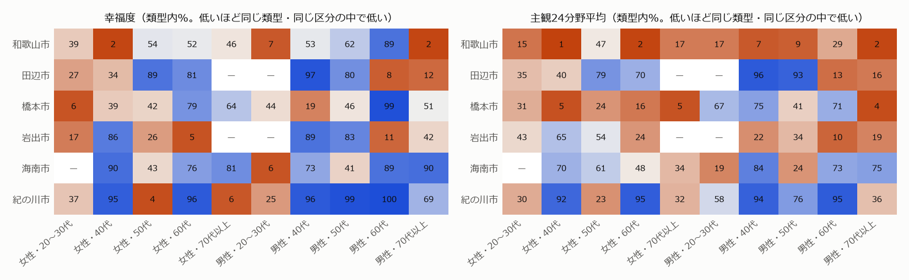
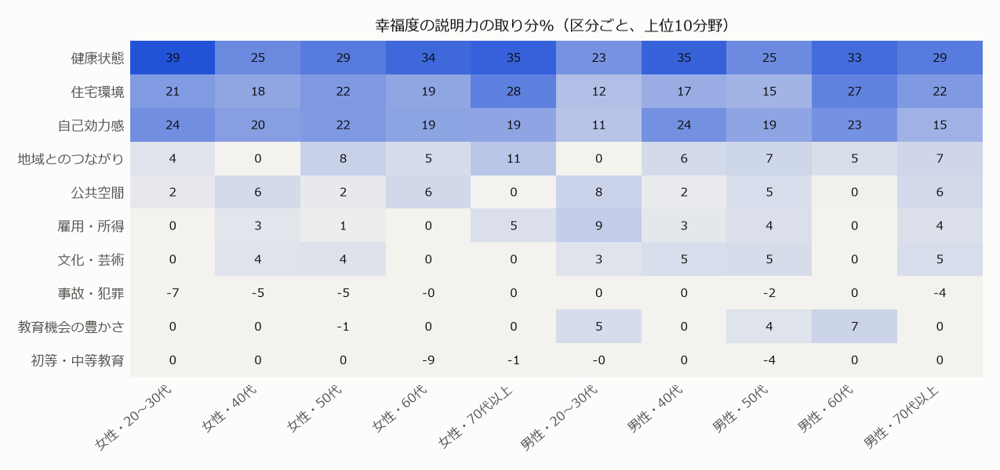
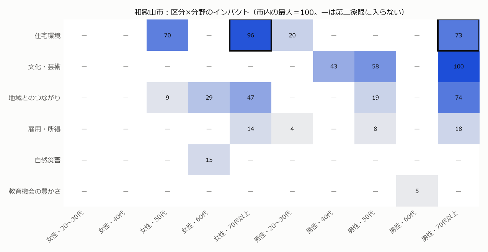
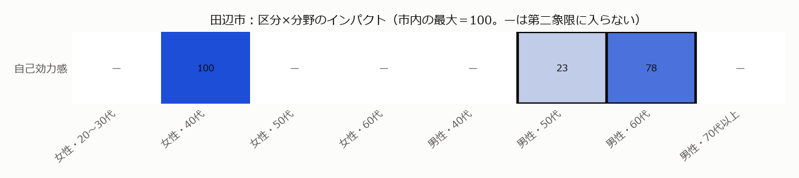

# 和歌山県 主観的ウェルビーイング分析　性別×年代

> **この版について**：元のレポート（[02_和歌山_地域類型×個別KPI分析.md](02_和歌山_地域類型×個別KPI分析.md)）は年代×性別の行を使っていたが、年代×性別は「比べる土台をそろえる」ためだけに使い、結果は市全体にまとめていた。この版では、**性別×年代の区分ごとに**立ち位置・説明力・下振れを出し、回答者数が十分で確かに下振れている区分の中から、**施策が刺さり、届く人数が多いターゲット層**を決めて、その層で伸ばす数値を選ぶ。示すのは市町村どうしの比較で見た関係性で、因果関係は示せていない（[言えること・言えないこと](#この分析で言えること言えないこと)）。

## アジェンダ

- はじめに：[目的](#目的) ／ [結論](#結論目的に対する答え) ／ [分析の流れ](#分析の流れ) ／ [前処理](#前処理-性別年代の区分と回答者数)
- 現状をつかむ：[ステップ1 区分ごとの立ち位置](#ステップ1-区分ごとの立ち位置) ／ [ステップ2 ターゲットの市](#ステップ2-ターゲットの市)
- 分野と層を絞る：[ステップ3 区分ごとの説明力](#ステップ3-区分ごとの説明力) ／ [ステップ4 重点分野とターゲット層](#ステップ4-重点分野とターゲット層)
- 数値を決める：[改善候補 ターゲット層で効く変数](#改善候補-ターゲット層で効く変数) ／ [ステップ5 因果の確認](#ステップ5-因果の確認) ／ [ステップ6 伸ばす数値](#ステップ6-伸ばす数値) ／ [言えること・言えないこと](#この分析で言えること言えないこと)

## 目的

**和歌山県の住民が実際に感じている幸福度を上げるために、どの市の、どの性別×年代の層の、どの分野の、どの数値を伸ばせばよいかを特定する。**

## 結論（目的に対する答え）

**和歌山市では男女・70代以上（約8.7万人）の住宅環境を重点にし、下水道処理人口普及率（公共下水道）・二重以上のサッシ又は複層ガラスの窓がある住宅の割合を伸ばす。田辺市では男性・50〜60代（約0.9万人）の自己効力感を重点にし、完全失業者数（人口比）を減らす。**

元の分析（市全体）の重点分野は和歌山市＝地域とのつながり・田辺市＝自己効力感。性別×年代で見ると、和歌山市は別の分野（住宅環境）、田辺市は同じになった。

## 分析の流れ

| ステップ | やること |
|---|---|
| 前処理 | 性別（2）×年代（5）の10区分を作る。市×区分の値は回答者が少なく振れやすいため、経験ベイズで縮めて不確かさも出す。 |
| ステップ1 | 和歌山6市の区分ごとの幸福度・主観24分野平均が、同じ類型・同じ区分の市町村の中でどの位置にあるか。 |
| ステップ2 | ターゲットの市は元の分析と同じ（類型内の順位と総合計画で決めた2市）。 |
| ステップ3 | 区分ごとに、幸福度を主観24分野で説明するElastic Net回帰を行い、分野の説明力を出す。 |
| ステップ4 | ターゲットの市の区分ごとに下振れと説明力から重点度を出し、人口をかけたインパクトが最大の「分野×層」を決める。層は、回答が確かに下振れている区分（2年度以上の回答・90%の確率で下振れ）だけでつくる。 |
| 改善候補 | ターゲット層の行だけで、重点分野の主観スコアを変数（個別KPI・追加の変数）で説明できるか、どの変数が効くかを確かめる。 |
| ステップ5 | ターゲット層の行だけで、固定効果モデルによる因果の確認。 |
| ステップ6 | 効く・施策で動かせる・伸びしろがある変数を伸ばす数値にする。 |

## 前処理　性別×年代の区分と回答者数

### 前.1 区分の作り方

性別（女性・男性）×年代（20〜30代・40代・50代・60代・70代以上）の**10区分**。元のデータの年代は10歳きざみだが、20代と80代以上は全国でも行が少ない（20代男性132行、80代以上女性55行）ため、隣の年代とまとめた。10代は全国で3行しかないため使わない。行は元の分析と同じ（市町村×年度×年代×性別、回答者5人以上、年度版2023〜26）。

**区分ごとの行数と回答者数（全国）**

| 区分 | 行数 | 市町村数 | 回答者数 |
|---|---|---|---|
| 女性・20〜30代 | 1,533 | 565 | 17,859 |
| 女性・40代 | 2,126 | 697 | 35,942 |
| 女性・50代 | 2,191 | 697 | 46,011 |
| 女性・60代 | 2,131 | 683 | 36,116 |
| 女性・70代以上 | 1,120 | 478 | 13,204 |
| 男性・20〜30代 | 798 | 370 | 8,275 |
| 男性・40代 | 2,130 | 690 | 35,287 |
| 男性・50代 | 2,204 | 700 | 67,233 |
| 男性・60代 | 2,207 | 702 | 62,570 |
| 男性・70代以上 | 2,195 | 665 | 32,670 |

- 回答者は40〜60代、特に男性に偏っている。20〜30代と70代以上は少ない。

### 前.2 市×区分の値を縮める（標本の大きさの扱い）

1つの市の1つの区分の回答者は数人〜百数十人で、平均は偶然で大きく振れる。そこで、次の2段で標本の大きさを結果に反映する。

1. **経験ベイズで縮める**：市×区分の値（同じ類型・同じ区分の平均との差）を、回答者が少ないほど0（類型の平均）に近づける。縮める強さは、区分ごとに「市町村どうしの本当の差の大きさ（τ²）」と「1人ひとりのばらつき（σ²）」をデータから推定して決める（縮める割合＝τ²／(τ²＋σ²／回答者数)）。あわせて標準誤差（不確かさ）も出す。
2. **確かな下振れ**：重点分野とターゲット層を決めるとき（ステップ4）は、縮めた下振れに標準誤差の1.28倍を足した値（90%の確率で、少なくともこれだけは下振れている、という控えめな値）を使う。回答者が多い区分は下振れがほぼそのまま残り、少ない区分は大きく割り引かれる。さらに、回答が1年度しかない区分は、その年の回答者の偏りを避けるため使わない。

### 前.3 人口
国勢調査2020の男女・年齢（5歳階級）別人口を、同じ10区分にまとめた（[04_年齢別人口.csv](../04_data/02_processed/04_年齢別人口.csv)）。インパクト（ステップ4）の重みに使う。

**ターゲットの市の区分ごとの人口と回答者数（年度2023〜26の合計）**

| 区分 | 和歌山市 人口 | 田辺市 人口 | 和歌山市 回答者 | 田辺市 回答者 |
|---|---|---|---|---|
| 女性・20〜30代 | 34,346 | 5,572 | 33 | 11 |
| 女性・40代 | 25,059 | 4,707 | 69 | 42 |
| 女性・50代 | 25,074 | 4,987 | 105 | 46 |
| 女性・60代 | 23,329 | 5,056 | 96 | 28 |
| 女性・70代以上 | 51,691 | 10,892 | 37 | 0 |
| 男性・20〜30代 | 34,088 | 5,626 | 13 | 0 |
| 男性・40代 | 24,232 | 4,623 | 54 | 39 |
| 男性・50代 | 22,243 | 4,578 | 144 | 53 |
| 男性・60代 | 21,002 | 4,715 | 121 | 56 |
| 男性・70代以上 | 35,162 | 7,482 | 62 | 8 |

## ステップ1　区分ごとの立ち位置

### 1.1 背景
元の分析は、6市の幸福度・主観スコアを市全体で見た。市全体で同じ順位でも、性別×年代によって強い層と弱い層がある可能性がある。

### 1.2 目的
和歌山6市の幸福度・主観24分野平均を、性別×年代の区分ごとに、同じ類型・同じ区分の市町村と比べる。

### 1.3 解き方
1. 各行の幸福度・主観24分野平均から、同じ「類型×年度×年代×性別」の平均を引く。
2. 市×区分ごとに年度をまとめて回答者数で平均し、経験ベイズで縮める（前.2）。
3. 同じ類型・同じ区分の市町村の中で、下から何%の位置か（類型内%）を出す。

### 1.4 結果

数字は類型内%（50が類型の真ん中。オレンジほど低く、青ほど高い）。—は回答者5人以上の行がない区分。

- 幸福度が同じ類型・同じ区分の下位10%以内にある区分：和歌山市（女性・40代・男性・20〜30代・男性・70代以上）、岩出市（女性・60代）、橋本市（女性・20〜30代）、海南市（男性・20〜30代）、田辺市（男性・60代）、紀の川市（女性・50代・女性・70代以上）。

- 同じ市の中でも区分によって位置が大きく違い、市全体の順位だけでは弱い層が見えない。

### 1.5 結論
> 性別×年代で見ると、同じ市の中でも強い層と弱い層がある。施策の対象を市全体ではなく層で決める意味がある。

スクリプト：[01_区分の立ち位置.py](../05_scripts/04_segment/01_区分の立ち位置.py)　結果：[01_和歌山6市.csv](../04_data/04_segment/01_和歌山6市.csv)

## ステップ2　ターゲットの市

元の分析と同じく、**和歌山市（都市部）と田辺市（農山村の小都市）**をターゲットの市とする（類型内の順位と総合計画で決めた。[元のレポートのステップ2](02_和歌山_地域類型×個別KPI分析.md#ステップ2-ターゲットの市)）。

## ステップ3　区分ごとの説明力

### 3.1 背景
幸福度にどの分野が効くかは、性別や年代で違う可能性がある（例：高齢者は健康、子育て世代は子育て）。元の分析は全区分をまとめて推定した。

### 3.2 目的
区分ごとに、幸福度を主観24分野で説明し、各分野の説明力（取り分）を出す。

### 3.3 解き方
元の分析のステップ3と同じ方法（類型×年度×年代×性別の平均を引き、標準化してElastic Net回帰。罰則は市町村単位の5分割交差検証で選ぶ）を、区分ごとの行だけで行う。区分ごとの行は全国で約800〜2,200行のため、類型ごとには分けず、類型をそろえた全国で推定する。取り分は係数の絶対値の割合（係数がマイナスの分野はマイナス）。

### 3.4 結果

交差検証R²は0.28〜0.42（区分ごと）。

- **健康状態・住宅環境・自己効力感の3分野は、どの区分でも上位**（区分ごとの取り分の平均で31%・20%・20%）。

- 健康状態の取り分は女性・20〜30代で最も大きく（39%）、男性・20〜30代で最も小さい（23%）。

- 住宅環境の取り分は女性・70代以上で最も大きく（28%）、男性・20〜30代で最も小さい（12%）。

- 自己効力感の取り分は女性・20〜30代で最も大きく（24%）、男性・20〜30代で最も小さい（11%）。

### 3.5 結論
> 幸福度に効く分野の上位は区分によらず同じだが、取り分の大きさは区分で違う。ステップ4では、区分ごとの取り分を使う。

スクリプト：[02_区分ごとの説明力.py](../05_scripts/04_segment/02_区分ごとの説明力.py)　結果：[02_区分ごとの説明力.csv](../04_data/04_segment/02_区分ごとの説明力.csv)

## ステップ4　重点分野とターゲット層

### 4.1 背景
区分ごとに弱い分野と、幸福度に効く分野がわかった。施策は特定の層に向けて行うので、市ごとに、どの層のどの分野を重点にするかを決める必要がある。その際、1つの区分だけを狙うより、共通して同じ分野が弱い区分をまとめた層のほうが、届く人数が多く、標本も大きく確かになる。

### 4.2 目的
ターゲットの市ごとに、**重点分野**と、その分野を上げる施策を向ける**ターゲット層（性別×年代）**を決める。

### 4.3 解き方

1. **下振れ（区分ごと）**：元の分析のステップ4と同じく、行ごとに主観24分野・客観24分野を標準化して「主観−客観」を出し、同じ類型×年度×年代×性別の平均を引く。市×区分ごとに縮める（前.2）。
2. **確かな下振れ**＝縮めた下振れ＋1.28×標準誤差。回答が2年度以上ある区分だけ使う。
3. **重点度**（市×区分×分野）：確かな下振れ＜0 かつ 説明力（ステップ3、その区分の取り分）＞均等割り（100÷24＝4.2%）なら、説明力×（−確かな下振れ）。それ以外は0。
4. **インパクト**＝重点度×その区分の人口。
5. **層の候補**：同じ性別で年代が続く区分、または男女両方で年代が続く区分をまとめたもの（例：女性・40〜60代、男女・70代以上）。層に入るすべての区分で、その分野の重点度が0より大きいものだけを候補にする。
6. **重点分野とターゲット層**：インパクトの合計が最大の「分野×層」。

### 4.4 この方法を使う理由

- **確かな下振れを使う**：回答者が少ない区分の平均は偶然で大きく振れる。控えめな値を使えば、標本が小さく不確かな区分が、たまたま大きな下振れで選ばれることを防げる。
- **2年度以上の回答を条件にする**：1年度だけの回答は、その年に答えた少数の人の偏りを反映しやすい。
- **人口をかける**：同じ重点度なら、人数が多い層ほど、主観スコアが上がったときに幸福度が上がる人が多い。
- **続く年代でまとめ、全区分が当てはまる層だけを候補にする**：施策は「40〜60代の女性」のようなまとまりに向けるのが現実的。弱くない区分を混ぜると、施策が刺さらない人に届けることになるため、層のどの区分にもその分野が刺さることを条件にした。条件を満たす中でインパクトの合計が最大の層を選ぶので、共通して弱い区分が多いほど大きな層にまとまる。

### 4.5 結果

**和歌山市（都市部）**

太枠がターゲット層。

| 順 | 分野 | 層 | 人口 | 回答者数 | 下振れ（縮めた値） | 確かな下振れ | 説明力 | インパクト（最大＝100） |
|---|---|---|---|---|---|---|---|---|
| 1 | 住宅環境 | 男女・70代以上 | 86,853 | 99 | −0.72 | −0.33 | 25% | 100 |
| 2 | 地域とのつながり | 男女・70代以上 | 86,853 | 99 | −1.10 | −0.75 | 9% | 71 |
| 3 | 文化・芸術 | 男性・40〜50代 | 46,475 | 198 | −2.02 | −1.78 | 5% | 59 |
| 4 | 文化・芸術 | 男性・70代以上 | 35,162 | 62 | −2.44 | −2.33 | 5% | 59 |
| 5 | 住宅環境 | 女性・70代以上 | 51,691 | 37 | −0.73 | −0.28 | 28% | 57 |
| 6 | 地域とのつながり | 女性・50〜70代以上 | 100,094 | 238 | −0.78 | −0.45 | 9% | 50 |

下振れ・説明力は層の中の区分を人口で平均した値。

- 元の分析の重点分野（地域とのつながり）の最良の層は男女・70代以上で、インパクトは71。

**田辺市（農山村の小都市）**

太枠がターゲット層。

| 順 | 分野 | 層 | 人口 | 回答者数 | 下振れ（縮めた値） | 確かな下振れ | 説明力 | インパクト（最大＝100） |
|---|---|---|---|---|---|---|---|---|
| 1 | 自己効力感 | 男性・50〜60代 | 9,293 | 109 | −0.96 | −0.23 | 21% | 100 |
| 2 | 自己効力感 | 女性・40代 | 4,707 | 42 | −1.24 | −0.49 | 20% | 99 |
| 3 | 自己効力感 | 男性・60代 | 4,715 | 56 | −0.99 | −0.33 | 23% | 77 |
| 4 | 自己効力感 | 男性・50代 | 4,578 | 53 | −0.92 | −0.13 | 19% | 23 |

下振れ・説明力は層の中の区分を人口で平均した値。

- 2位の自己効力感×女性・40代とのインパクトの差は小さい（100対99）。

- 回答が1年度しかないため層に使わなかった区分：男性・70代以上（回答者8人）。

### 4.6 結論

> 和歌山市の重点分野は住宅環境、ターゲット層は男女・70代以上（人口86,853人、回答者99人）。田辺市の重点分野は自己効力感、ターゲット層は男性・50〜60代（人口9,293人、回答者109人）。

スクリプト：[03_重点分野とターゲット層.py](../05_scripts/04_segment/03_重点分野とターゲット層.py)　結果：[03_区分マトリクス.csv](../04_data/04_segment/03_区分マトリクス.csv)・[03_層の候補.csv](../04_data/04_segment/03_層の候補.csv)

## 改善候補　ターゲット層で効く変数

### 5A.1 背景
ターゲット層と重点分野が決まった。その層の重点分野の主観スコアと関係がある変数を探す。全区分で効く変数でも、ターゲット層では効かない（または逆に、ターゲット層だけで効く）可能性がある。

### 5A.2 目的
ターゲット層の重点分野の主観スコアを、その分野の変数（個別KPI・追加の変数）で説明できるか、どの変数が効くかを確かめる。

### 5A.3 解き方

1. **データ**：全国の市町村×年度×年代×性別の行のうち、ターゲット層の区分に入る行。目的変数はその行の重点分野の主観スコア、説明変数は市町村×年度の変数（元の改善候補①②と同じ値）。回答者数で重みづけ。
2. **モデル**（Elastic Net、元の分析と同じ方法）：土台（類型・類型の6変数・年度・年代×性別のダミー）／土台＋個別KPI／土台＋個別KPI＋追加の変数。
3. **判定**：土台に対する最終モデルの交差検証R²の上乗せの95%信頼区間（市町村単位のブートストラップ）の下限が0を超えれば「説明できる」。
4. **効いた変数**：市町村単位のブートストラップ（200回）で想定どおりの向きが90%以上。
5. **全区分と比べる**：同じモデルを全区分（全年代・男女）の行でも推定し、係数を比べる。

### 5A.4 結果

| 市×分野 | 範囲 | 行数 | 土台 | 最終モデル | 最終モデルのR² | 上乗せ [95%信頼区間] | 判定 |
|---|---|---|---|---|---|---|---|
| 和歌山市×住宅環境 | ターゲット層（男女・70代以上） | 3,312 | 10.6 | 土台＋個別KPI＋追加の変数 | 13.6 | +3.0 [+1.2, +5.0] | 説明できる |
| 和歌山市×住宅環境 | 全区分 | 18,591 | 18.1 | 土台＋個別KPI＋追加の変数 | 21.1 | +3.1 [+1.7, +4.5] | 説明できる |
| 田辺市×自己効力感 | ターゲット層（男性・50〜60代） | 4,411 | 31.1 | 土台＋個別KPI＋追加の変数 | 35.1 | +4.1 [+2.5, +5.8] | 説明できる |
| 田辺市×自己効力感 | 全区分 | 18,635 | 33.4 | 土台＋個別KPI＋追加の変数 | 35.5 | +2.1 [+1.4, +2.9] | 説明できる |

交差検証R²は%。

**和歌山市×住宅環境：変数の係数（ターゲット層 男女・70代以上 と全区分）**

| 変数 | 種別 | 望ましい向き | ターゲット層の係数 | 想定どおりの向き | 全区分の係数 | 全区分で効いた | 施策で動かせるか |
|---|---|---|---|---|---|---|---|
| **住宅地の平均価格（都道府県地価調査）** | 追加の変数 | − | −1.06 | 100% | −0.63 | ○ | 動かせない |
| **1980年以前に建築された住宅（旧耐震基準）の割合** | 追加の変数 | − | −0.99 | 100% | −0.82 | ○ | 動かせない |
| **2019年以降に増改築・改修工事をした持ち家の割合** | 追加の変数 | ＋ | +0.73 | 97% | +0.75 | ○ | 動かせる |
| **二重以上のサッシ又は複層ガラスの窓がある住宅の割合** | 追加の変数 | ＋ | +0.72 | 100% | +0.67 | ○ | 動かせる |
| **民営借家（専用住宅）の延べ面積1m²当たり家賃** | 追加の変数 | − | −0.59 | 99% | −1.04 | ○ | 動かせない |
| **下水道処理人口普及率（公共下水道）** | 追加の変数 | ＋ | +0.32 | 94% | +0.71 | ○ | 動かせる |
| 一戸建の持ち家の割合 | 個別KPI | ＋ | +0.27 | 88% | 0.00 | — | 動かせない |
| 住宅当たり延べ面積 | 個別KPI | ＋ | +0.06 | 52% | 0.00 | — | 動かせない |
| 高齢者等のための設備（手すり・段差のない屋内など）がある住宅の割合 | 追加の変数 | ＋ | 0.00 | 55% | +0.03 | — | 動かせる |
| 腐朽・破損のある住宅の割合 | 追加の変数 | − | +0.02 | 42% | −0.26 | ○ | 動かせる |
| 賃貸・売却用及び二次的住宅を除く空き家（いわゆる放置空き家）の割合 | 追加の変数 | − | +0.43 | 4% | +0.23 | — | 動かせる |
| 人口1万人あたり市町村営の公営住宅等の戸数 | 追加の変数 | ＋ | −0.70 | 15% | −0.57 | — | 動かせる |

太字がターゲット層で効いた変数。係数は、変数が標準偏差1つ分違うと主観スコアが何点違うか。

**田辺市×自己効力感：変数の係数（ターゲット層 男性・50〜60代 と全区分）**

| 変数 | 種別 | 望ましい向き | ターゲット層の係数 | 想定どおりの向き | 全区分の係数 | 全区分で効いた | 施策で動かせるか |
|---|---|---|---|---|---|---|---|
| **卒業者に占める大学・大学院卒業者の割合** | 追加の変数 | ＋ | +3.42 | 100% | +3.50 | ○ | 動かせない |
| **民営事業所に占める新設事業所の割合** | 追加の変数 | ＋ | +0.99 | 98% | +0.85 | ○ | 動かせる |
| **納税義務者1人あたり課税対象所得** | 追加の変数 | ＋ | +0.96 | 98% | +0.97 | ○ | 動かせる |
| **完全失業者数（人口比）** | 個別KPI | − | −0.90 | 98% | −0.90 | ○ | 動かせる |
| 女性の就業率（15歳以上） | 追加の変数 | ＋ | +0.74 | 84% | +3.16 | ○ | 動かせる |
| 転入超過割合 | 個別KPI | ＋ | +0.45 | 79% | +0.31 | — | 動かせない |
| 人口千人あたり新設事業所数（2016〜2021年） | 追加の変数 | ＋ | +0.35 | 90% | +0.33 | — | 動かせる |
| 20〜39歳の転入超過率 | 追加の変数 | ＋ | +0.23 | 72% | +0.26 | — | 動かせない |
| 65歳以上の就業率 | 追加の変数 | ＋ | 0.00 | 39% | +0.11 | — | 動かせる |
| 雇用者に占める正規の職員・従業員の割合 | 追加の変数 | ＋ | −0.32 | 14% | −0.02 | — | 動かせる |
| 20〜39歳人口の割合 | 追加の変数 | ＋ | −0.60 | 11% | −0.58 | — | 動かせない |
| 就業率（15歳以上） | 追加の変数 | ＋ | −2.59 | 0% | −5.62 | — | 動かせる |

太字がターゲット層で効いた変数。係数は、変数が標準偏差1つ分違うと主観スコアが何点違うか。

スクリプト：[04_ターゲット層の変数.py](../05_scripts/04_segment/04_ターゲット層の変数.py)　結果：[04_説明力.csv](../04_data/04_segment/04_説明力.csv)・[04_変数の係数.csv](../04_data/04_segment/04_変数の係数.csv)

## ステップ5　因果の確認

元の分析のステップ5と同じ固定効果モデル（同じ地域・同じ年代×性別の中で、変数が年ごとに変わったときに主観スコアと幸福度も変わったか）を、ターゲット層の行だけで行う。対象は年度ごとに値がある変数。

| 市 | 変数 | 目的変数 | 係数 [95%信頼区間] | p値 | q値 | 判定 |
|---|---|---|---|---|---|---|
| 和歌山市 | 住宅地の平均価格（都道府県地価調査） | 重点分野の主観スコア | +1.61 [−1.83, +5.05] | 0.36 | 0.36 | 判別できず |
| 和歌山市 | 住宅地の平均価格（都道府県地価調査） | 幸福度 | +0.07 [−0.10, +0.24] | 0.43 | 0.65 | 判別できず |
| 和歌山市 | 人口1万人あたり市町村営の公営住宅等の戸数 | 重点分野の主観スコア | +20.85 [−5.59, +47.29] | 0.12 | 0.21 | 判別できず |
| 和歌山市 | 人口1万人あたり市町村営の公営住宅等の戸数 | 幸福度 | +0.30 [−1.07, +1.66] | 0.67 | 0.67 | 判別できず |
| 和歌山市 | 下水道処理人口普及率（公共下水道） | 重点分野の主観スコア | −18.62 [−43.41, +6.18] | 0.14 | 0.21 | 判別できず |
| 和歌山市 | 下水道処理人口普及率（公共下水道） | 幸福度 | −0.48 [−1.48, +0.52] | 0.35 | 0.65 | 判別できず |
| 田辺市 | 転入超過割合 | 重点分野の主観スコア | +0.10 [−0.67, +0.87] | 0.81 | 0.85 | 判別できず |
| 田辺市 | 転入超過割合 | 幸福度 | +0.03 [0.00, +0.05] | 0.02 | 0.07 | 想定どおりに有意 |
| 田辺市 | 納税義務者1人あたり課税対象所得 | 重点分野の主観スコア | −0.16 [−1.86, +1.54] | 0.85 | 0.85 | 判別できず |
| 田辺市 | 納税義務者1人あたり課税対象所得 | 幸福度 | +0.03 [0.00, +0.07] | 0.07 | 0.09 | 判別できず |
| 田辺市 | 20〜39歳人口の割合 | 重点分野の主観スコア | +0.76 [−5.79, +7.32] | 0.82 | 0.85 | 判別できず |
| 田辺市 | 20〜39歳人口の割合 | 幸福度 | +0.11 [−0.13, +0.35] | 0.37 | 0.37 | 判別できず |
| 田辺市 | 20〜39歳の転入超過率 | 重点分野の主観スコア | +0.17 [−0.96, +1.31] | 0.76 | 0.85 | 判別できず |
| 田辺市 | 20〜39歳の転入超過率 | 幸福度 | +0.04 [0.00, +0.07] | 0.04 | 0.08 | 想定どおりに有意 |

- 想定どおりに有意は2件、逆向きに有意は0件。

スクリプト：[05_ターゲット層の因果の確認.py](../05_scripts/04_segment/05_ターゲット層の因果の確認.py)　結果：[05_因果_係数.csv](../04_data/04_segment/05_因果_係数.csv)

## ステップ6　伸ばす数値

元の分析のステップ6と同じく、ターゲット層のモデルで**効いた**・**施策で動かせる**・**伸びしろがある**（同じ類型の上位4分の1に届いていない）変数を伸ばす数値にする。因果の確認で逆向きに有意な変数は除く。

**和歌山市×住宅環境（ターゲット層 男女・70代以上。効いた変数）**

| 変数 | 係数 | 和歌山市 | 目標（類型の上位4分の1） | 類型内% | 伸びしろ | 施策で動かせるか | 因果の確認 | 全区分で効いた | 伸ばす数値 |
|---|---|---|---|---|---|---|---|---|---|
| **下水道処理人口普及率（公共下水道）** | +0.32 | 38.41 | 99.55 | 3 | 61.14 | 動かせる | 判別できず | ○ | ● |
| **二重以上のサッシ又は複層ガラスの窓がある住宅の割合** | +0.72 | 24.64 | 33.91 | 21 | 9.27 | 動かせる | 1時点のみ（確かめられない） | ○ | ● |
| 1980年以前に建築された住宅（旧耐震基準）の割合 | −0.99 | 25.75 | 15.21 | 6 | 10.54 | 動かせない | 1時点のみ（確かめられない） | ○ | — |
| 住宅地の平均価格（都道府県地価調査） | −1.06 | 73,452 | 69,563 | 73 | 3,890 | 動かせない | 判別できず | ○ | — |
| 2019年以降に増改築・改修工事をした持ち家の割合 | +0.73 | 30.61 | 29.54 | 86 | 0.00 | 動かせる | 1時点のみ（確かめられない） | ○ | — |
| 民営借家（専用住宅）の延べ面積1m²当たり家賃 | −0.59 | 1,062 | 1,158 | 93 | 0.00 | 動かせない | 1時点のみ（確かめられない） | ○ | — |

**田辺市×自己効力感（ターゲット層 男性・50〜60代。効いた変数）**

| 変数 | 係数 | 田辺市 | 目標（類型の上位4分の1） | 類型内% | 伸びしろ | 施策で動かせるか | 因果の確認 | 全区分で効いた | 伸ばす数値 |
|---|---|---|---|---|---|---|---|---|---|
| **完全失業者数（人口比）** | −0.90 | 2.25 | 1.68 | 12 | 0.57 | 動かせる | 1時点のみ（確かめられない） | ○ | ● |
| 卒業者に占める大学・大学院卒業者の割合 | +3.42 | 12.30 | 15.83 | 39 | 3.54 | 動かせない | 1時点のみ（確かめられない） | ○ | — |
| 納税義務者1人あたり課税対象所得 | +0.96 | 3,040 | 3,038 | 75 | 0.00 | 動かせる | 判別できず | ○ | — |
| 民営事業所に占める新設事業所の割合 | +0.99 | 20.40 | 19.19 | 83 | 0.00 | 動かせる | 1時点のみ（確かめられない） | ○ | — |

### 6.1 結論

> 和歌山市は男女・70代以上の住宅環境を上げるために、下水道処理人口普及率（公共下水道）・二重以上のサッシ又は複層ガラスの窓がある住宅の割合を伸ばす。田辺市は男性・50〜60代の自己効力感を上げるために、完全失業者数（人口比）を減らす。

スクリプト：[06_伸ばす数値.py](../05_scripts/04_segment/06_伸ばす数値.py)　結果：[06_伸ばす数値.csv](../04_data/04_segment/06_伸ばす数値.csv)

## この分析で言えること・言えないこと

**言えること**

- ターゲット層は、回答が2年度以上あり、90%の確率で同じ類型・同じ区分の市町村より主観スコアが下振れている区分だけでつくった。
- 伸ばす数値は、全国のターゲット層の行で、その数値が高い（または低い）市町村ほど重点分野の主観スコアが高い、という関係が、市町村を入れ替えて学習し直しても同じ向きに出たもの。

**言えないこと**

- **伸ばせば主観スコアや幸福度が上がるという因果関係は示せていない**（ステップ5）。
- 変数は市町村全体の値で、ターゲット層だけの値ではない（例：女性の就業率は女性全体、図書館数は市全体）。層に向けた施策の効果は、層の値を測って確かめる必要がある。
- 市×区分の回答者は数十〜百数十人で、縮めた値にも不確かさが残る。2位の層との差が小さい場合は、どちらを選んでも結論が大きく変わらないかを確認する必要がある。
