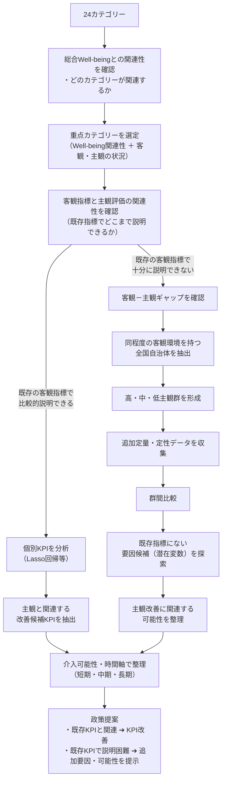

# けいた君のを読んで

## 1. 背景とアプローチの整理（けいた案の検証と改善点）

### ① 「相関 ≒ 0」の分野をどう扱うか
* **けいた案の懸念点：** 相関がほぼ0の分野を除外（足切り）すると、「既存の客観指標（データ）では測れていないが、住民の主観には強く影響している要素（潜在変数）」を持つ重要な分野を切り捨ててしまうリスクがあります。※ここでの潜在変数は「カテゴリ内で構成（指標化）されていない変数」を指します。
* **改善アプローチ：** 相関が低い分野は除外するのではなく、**「データ外の潜在変数が強く影響している領域」**と捉え、定性分析・都市比較のルートへ流して原因を探ります。

### ② Lasso回帰の限界と「潜在変数」の追加設定
* **けいた案の数式：** $\text{最優先分野の主観カテゴリスコア} = \sum \gamma_k \times \text{客観個別KPI}_k + \text{統制変数} + \varepsilon$
* **Lasso回帰の限界：** Lassoは208本の既存KPIの中から関連性の高いものを絞り込むには非常に有効ですが、**「データベースに登録されていない要素（運用面・広報・UI等）」は構造上検出できません。**
* **改善アプローチ：** 主観評価の改善可能性を検討した後に、**「既存の客観指標で説明できるか／説明困難か（潜在変数が強いか）」**の分岐を挟み、説明困難なケースには他都市比較やLLM解析等で「データ外の要素」をあぶり出すアプローチを接続します。
詳しくはNishimura/docs参照

---

## 2. 分析アルゴリズム全体フロー

---

## 3. 各プロセスの役割と分析仕様

| プロセス | 分析・処理内容 | 主なアプローチ・手法 |
| :--- | :--- | :--- |
| **1. 関連性確認** | 24カテゴリの中から、総合Well-beingを高める上で影響力の大きいカテゴリを特定する |  |
| **2. 重点カテゴリ選定** | 総合Well-beingへの影響度に加え、対象自治体の現状（主観・客観のスコアバランス）を加味して優先領域を絞り込む |  |
| **3. 説明力の判定** | 重点カテゴリにおいて、「既存の客観指標で主観を説明できるか（$R^2$が高いか）」を評価しルート分岐 |  |
| **【ルートA】説明可能** | 208本の既存客観KPIから、主観スコアの向上に直結するキラーKPIを特定し目標値を設定する | けいた案 |
| **【ルートB】説明困難** | 既存データで測れない「潜在変数（広報・運用・認知など）」を探索するため、似た環境の自治体と比較・分析を行う | 定性分析（同環境自治体の抽出、LLMを用いた定性テキスト解析） |
| **4. 施策化・提言** | 定量・定性の両ルートから得られた課題を、介入可能性と時間軸（短・中・長期）で分類し政策に落とし込む | 政策企画・事業立案 |
