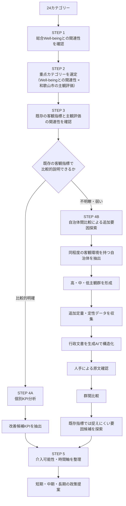

# 和歌山市におけるWell-being向上に向けた分析設計書

## 1．目的

本研究では、和歌山市における住民のWell-being向上に向けて、
住民が感じている生活上の課題や地域の特徴を把握するとともに、
Well-beingの向上に向けて重点的に取り組むべき分野と、その改善に
つながる可能性のある要因を明らかにすることを目的とする。

また、分析結果を単に現状の評価にとどめるのではなく、得られた
改善候補を短期・中期・長期の時間軸で整理し、和歌山市の実情に
応じた具体的な政策提案および政策ロードマップにつなげることを目指す。

なお、本研究は観察データを用いた分析であるため、特定の政策や
施策によるWell-beingへの因果効果を直接証明するものではなく、
Well-beingの向上に向けて検討すべき改善候補や要因を探索することを
目的とする。

---

## 2．データソース

### 2.1 地域幸福度（Well-Being）指標

デジタル庁「地域幸福度（Well-Being）指標」ダッシュボードを使用する。  
https://well-being.digital.go.jp/dashboard

都道府県・市区町村・年度を選択することで、主観的Well-beingおよび客観的Well-beingに関する指標を取得する。

#### スコア仕様
主観・客観ともに全国調査結果をもとに偏差値化されている。

* **平均：** 50
* **標準偏差：** 10

そのため、本研究では24カテゴリーを同一スケール上で比較する。

### 2.2 24カテゴリー

#### 生活環境（16カテゴリー）
1. 医療・福祉
2. 買物・飲食
3. 住宅環境
4. 移動・交通
5. 遊び・娯楽
6. 子育て
7. 初等・中等教育
8. 地域行政
9. デジタル生活
10. 公共空間
11. 都市景観
12. 自然景観
13. 自然の恵み
14. 環境共生
15. 自然災害
16. 事故・犯罪

#### 地域の人間関係（2カテゴリー）
17. 地域とのつながり
18. 多様性と寛容性

#### 自分らしい生き方（6カテゴリー）
19. 自己効力感
20. 健康状態
21. 文化・芸術
22. 教育機会の豊かさ
23. 雇用・所得
24. 事業創造

---

## 3．目的変数

本研究では、総合Well-beingを評価する指標として、住民の**生活満足度**を主たる目的変数とする。  
ただし、利用可能なデータの内容を確認した上で、総合Well-beingに関連する他の指標についても補助的に分析する可能性がある。

---

## 4．分析全体の考え方

本研究では、和歌山市における住民のWell-being向上を目的として、24カテゴリーの
主観評価と生活満足度との関係を起点に、Well-beingの向上に向けて重点的に
取り組むべき分野と、その改善につながる可能性のある要因を段階的に探索する。

分析では、まず和歌山市において重点的に検討すべきカテゴリーを明らかにし、
そのカテゴリーについて、既存の客観指標との関係を確認する。客観指標との
関連が比較的明確な場合には、当該カテゴリーの客観指標を構成するために
用いられている個別データまで掘り下げ、改善候補となるKPIを探索する。

一方、既存の客観指標だけでは主観評価の差を十分に説明できない場合には、
客観環境が類似する自治体との比較を通じて、既存指標では捉えられていない
追加的な要因を探索する。この場合には、既存の客観指標を構成するために
用いられているデータとは異なる、追加的な定量・定性データを収集・分析する。

これらの結果をもとに、改善候補となるKPI・要因を、自治体が実施可能な
**短期・中期・長期の視点**から整理し、段階的な政策提案につなげる。

* **短期：** 既存の制度・サービス・情報発信等の改善など、比較的早期に
  実施可能な取り組み
* **中期：** 施設・サービスの運用改善や地域・民間との連携など、一定の
  準備・調整を要する取り組み
* **長期：** 都市構造、交通、地域環境など、効果の発現に時間を要する
  取り組み

最終的には、単に「評価が低い分野」を示すのではなく、

**「どの分野を重点的に検討すべきか」  
→「既存の客観指標を構成する個別KPIのうち、何を改善候補として考えるべきか」  
→「既存指標では捉えられない場合、どのような追加要因が関連している可能性があるか」  
→「短期・中期・長期でどのように取り組むか」**

という流れで整理し、和歌山市におけるWell-being向上に向けた政策ロードマップの
作成につなげる。

なお、本研究では、観察データを用いた分析から政策介入の因果効果を直接証明する
ことを目的としない。統計的な関係が確認された要因は改善候補として扱い、
自治体間比較から得られた差異については、主観評価の差に関連する可能性のある
要因として扱う。


# 分析ステップ一覧表

| STEP | 分析内容 | 主な目的 |
| :--- | :--- | :--- |
| **STEP 1** | 24カテゴリーと総合Well-beingの関連性確認 | 生活満足度と関連するカテゴリーを把握する |
| **STEP 2** | 重点カテゴリーの選定 | Well-beingとの関連性が高く、和歌山市の主観評価が低いカテゴリーを特定する |
| **STEP 3** | 既存の客観指標と主観評価の関連性確認 | 客観指標によって主観評価の差をどこまで説明できるか確認する |
| **STEP 4A** | 【ルートA】個別KPI分析 | 既存の客観指標との関連が比較的明確なカテゴリーについて、改善候補KPIを特定する |
| **STEP 4B** | 【ルートB】自治体間比較による追加要因探索 | 既存の客観指標だけでは説明しにくいカテゴリーについて、追加的な要因候補を探索する |
| **STEP 5** | 【ルートB】類似自治体の抽出準備 | 類似自治体の抽出に用いる指標を整理 |
| **STEP 6** | 【ルートB】類似自治体の抽出 | 和歌山市と客観環境が同程度の自治体を抽出する |
| **STEP 7** | 【ルートB】高・中・低主観群の形成 | 同程度の客観環境における主観評価の違いを比較可能にする |
| **STEP 8** | 【ルートB】追加データの収集 | 既存指標では捉えられていない可能性のある情報を収集する |
| **STEP 9** | 【ルートB】生成AIによる行政文書の構造化 | 自治体ごとに異なる行政文書を共通項目に整理する |
| **STEP 10** | 【ルートB】生成AIの結果を人手で確認 | 抽出内容の正確性と原文との整合性を確認する |
| **STEP 11** | 【ルートB】追加データを統合した群間比較 | 高主観群と低主観群の特徴の違いを比較する |
| **STEP 12** | 【ルートB】主観評価の差に関連する要因候補の抽出 | 既存指標では捉えにくい要因候補を特定する |
| **STEP 13** | 【合流】改善候補KPI・要因候補の介入可能性評価 | 4Aの改善候補KPIと4Bの要因候補を短期・中期・長期等に整理する |
| **STEP 14** | 政策提案 | 分析結果を具体的な改善施策につなげる |
| **STEP 15** | 政策ロードマップの作成 | 短期・中期・長期の施策として整理する |
---

## 5．STEP 1：24カテゴリーと総合Well-beingの関連性確認
### 分析対象自治体の選定

STEP 1以降の分析に先立ち、自治体ごとのデータ蓄積状況を確認する。

自治体によって観測年度数や各年度の有効回答者数が異なるため、以下の2つの基準を設け、分析対象自治体を選定する。

1. **観測年度数**
   - 同一自治体について一定数以上の調査年度が存在すること。

2. **年度別の有効サンプル数**
   - 各自治体・年度について、生活満足度等の分析に利用可能な有効回答者数が一定数以上であること。

まず、自治体ごとの観測年度数および自治体・年度別の有効サンプル数の分布を確認する。
その上で、データ分布と分析上必要な観測数を踏まえて基準値を設定する。

原則として、両方の基準を満たす自治体をSTEP 1以降の分析対象とする。
### 5.1 目的
24カテゴリーの主観指標と生活満足度との統計的関係を確認し、重点的に分析するカテゴリーをスクリーニングする。
### 5.2　分析単位・データ設計

STEP 1では、全国の市区町村における複数年度のデータを用いて、
24カテゴリーの主観指標と生活満足度との統計的関係を確認する。

- **1行 = 1自治体（市区町村）× 1年度**
- **対象範囲：** 全国の市区町村 × 利用可能な調査年度
- **目的変数 \(Y\)：** 生活満足度
- **説明変数 \(X_1～X_{24}\)：** 24カテゴリーの主観指標
- **地域情報：** 自治体名・都道府県
- **時点情報：** 調査年度

なお、複数年度のデータを用いる場合には、年度による違いを考慮した上で
カテゴリーと生活満足度との関係を分析する。
### 5.3 分析方法
#### 【Phase 1】線形 vs 非線形の事前検証（構造探査）

単一の回帰モデルをあてはめる前に、24カテゴリーの主観指標と生活満足度との関係が線形（比例関係）か、非線形（飽和・閾値等）かを検証する。

なお、STEP 1では全国の市区町村×複数年度のデータを用いるため、分析において**年度による共通の変化**および**自治体による固有の違い**を考慮する。

1. **散布図 ＆ LOWESS（局所加重回帰）による視覚確認**
   * 各カテゴリー $X_j$ と生活満足度 $Y$ の散布図を描き、LOWESS等の非パラメトリック平滑化線を重ねて、関係の形状を確認する。
   * 特に、直線的な関係だけでなく、頭打ち、飽和、閾値等の非線形な形状が存在するかを確認する。
   * 必要に応じて年度別の分布も確認し、特定年度の影響によって関係が生じていないかを確認する。

2. **単変数GAM（一般化加法モデル）による統計的判定**
   * 平滑化スプライン関数の有効自由度（$\text{edf}$）を確認する。
   * 年度による共通の変化を考慮するため、年度効果をモデルに含める。
   * 非線形性については、$\text{edf}$のみで機械的に判断せず、平滑化曲線の形状、統計的有意性、線形モデルとの適合度を総合的に確認する。

3. **適合度比較（AIC / BIC ＆ Ramsey RESETテスト）**
   * 年度効果を考慮した線形モデルと、対数変換 $\log(X)$ や2次項 $X^2$ を組み込んだモデルのAIC/BICを比較し、モデル仕様の妥当性を確認する。
   * Ramsey RESETテストは、線形モデルでは捉えにくい非線形構造の有無を補助的に確認するために用いる。

---

#### 【Phase 2-A】線形モデルアプローチ（線形近似が妥当な場合）

事前検証で線形近似が妥当と判断された場合、年度による共通の変化を考慮しながら、24カテゴリーを同時に扱い、各カテゴリーと生活満足度との条件付きの関連を評価する。

##### ① データ前処理とリーケージ（データ漏洩）対策

* **標準化（$z$化）：**
  全指標のスケールを揃えるため、$X$（24カテゴリー）および $Y$（生活満足度）を標準化する。
* **年度効果：**
  調査年度による全国的な共通変化を考慮するため、年度をモデルに含める。
* **自治体効果：**
  自治体固有の特徴による影響を確認するため、自治体固定効果モデルを感度分析として用いる。
* **GroupKFold交差検証：**
  同一自治体の複数年度データが訓練データと検証データに分かれることによる情報漏洩を防ぐため、自治体コードをグループとしたGroupKFold（5分割等）を用いる。

##### ② 基本モデルによる関連性の評価

年度効果を考慮した基本モデルとして、以下のモデルを用いる。

$$Y_{it} = \beta_0 + \sum_{j=1}^{24}\beta_j X_{jit} + \gamma_t + \epsilon_{it}$$

ここで、
* $Y_{it}$：自治体 $i$・年度 $t$ の生活満足度
* $X_{jit}$：自治体 $i$・年度 $t$ におけるカテゴリー $j$ の主観指標
* $\beta_j$：他のカテゴリーを同時に考慮した上でのカテゴリー $j$ と生活満足度との条件付きの関連
* $\gamma_t$：年度による全国共通の変化
* $\epsilon_{it}$：誤差項

とする。

##### ③ Elastic Net回帰によるカテゴリーの関連性評価

* L1正則化（Lasso）とL2正則化（Ridge）を組み合わせたElastic Netを構築する。
* 相関の高いカテゴリー群における情報の吸収を考慮し、$\text{l1\_ratio}$ はRidge寄り（$0.1 \sim 0.3$）を優先的に検討する。
* 推定された標準化偏回帰係数 $\beta_j$ を用いて、各カテゴリーと生活満足度との条件付きの関連の大きさと方向を評価する。
* 係数の絶対値 $|\beta_j|$ によって関連の強さを比較し、符号によって関連の方向を確認する。

##### ④ 相対的重要度の評価

* モデル全体の説明力に対して、各カテゴリーがどの程度の相対的重要度を持つかをSHAPまたはLMGを用いて評価する。
* 「寄与率」は因果的な貢献度を意味するものではなく、**当該モデルにおける相対的重要度**として解釈する。
* Elastic Netの係数とSHAP/LMGの重要度を併せて確認し、複数の指標で一貫して重要と評価されるカテゴリーを重点候補として整理する。

##### ⑤ 自治体固定効果による感度分析

自治体固有の時間不変な特徴を考慮した場合にも結果が維持されるかを確認するため、自治体固定効果を含む以下のモデルを補助的に推定する。

$$Y_{it} = \alpha_i + \gamma_t + \sum_{j=1}^{24}\beta_j X_{jit} + \epsilon_{it}$$

ここで、
* $\alpha_i$：自治体 $i$ に固有の時間不変な特徴
* $\gamma_t$：年度による全国共通の変化

を表す。

基本モデルと自治体固定効果モデルの結果を比較し、両モデルで一貫して関連が確認されるカテゴリーを、より頑健な重点候補として評価する。

なお、自治体固定効果モデルでは自治体間の恒常的な違いが調整されるため、基本モデルとは異なり、**同一自治体内における年度間の変化**を主に利用した関連性の評価となる。この違いを踏まえて結果を解釈する。

---

#### 【Phase 2-B】非線形モデルアプローチ（非線形構造が確認された場合）

非線形構造が確認された場合は、無理に直線モデルへ近似せず、年度による共通の変化を考慮しながら非線形な関係を評価する。

##### ① GAMによる非線形関係の把握

以下のようなGAMを用いて、各カテゴリーと生活満足度との非線形な関係を確認する。

$$Y_{it} = \beta_0 + f_j(X_{jit}) + \gamma_t + \epsilon_{it}$$

ここで、
* $f_j(X_{jit})$：カテゴリー $j$ と生活満足度との非線形な関係
* $\gamma_t$：年度による全国共通の変化

を表す。

各カテゴリーの平滑化スプライン曲線 $f_j(X_j)$ を描画し、「どのスコア帯で生活満足度との統計的な関連が強くなるか、または弱くなるか」を確認する。

なお、曲線上に確認された飽和や閾値は、**政策投資の限界や因果効果を直接意味するものではなく、主観評価と生活満足度との統計的関連が変化する領域**として解釈する。

必要に応じて、自治体固定効果を考慮したモデルについても補助的に検討する。

##### ② LightGBM ＋ TreeSHAPによる補助分析

GAMだけでは捉えにくい複雑な非線形性やカテゴリー間の相互作用を確認する必要がある場合、補助的にLightGBMを用いる。

* LightGBMを用いて24カテゴリーから生活満足度を予測する。
* 年度情報をモデルに含め、年度による共通の変化を考慮する。
* TreeSHAPを適用し、各カテゴリーの相対的重要度を算出する。
* SHAP依存性プロット等を用いて、カテゴリーのスコア水準による予測への寄与の変化を確認する。
* 必要に応じてカテゴリー間の相互作用についても確認する。
* ただし、LightGBMおよびSHAPによる結果も因果効果ではなく、**予測モデル上の関連性・重要度**として解釈する。

---

### 5.4 分析結果の解釈ルール

1. **因果関係ではなく統計的関連性**
   * 本ステップで得られた係数、GAMの曲線、SHAP/LMGの重要度は、原則として統計的な関連性を示すものであり、特定の政策介入による生活満足度への因果効果を意味しない。

2. **年度差・自治体差の考慮**
   * 全国の市区町村×複数年度をプールするため、年度による全国共通の変化を年度効果としてモデルに含める。
   * 自治体固有の時間不変な特徴については、自治体固定効果モデルを感度分析として用いて結果の頑健性を確認する。
   * 基本モデルと固定効果モデルでは利用している変動の種類が異なるため、両者の結果を機械的に同一視せず、補完的に解釈する。

3. **多重共線性・情報の吸収への注意**
   * Elastic Netで $\beta_j \approx 0$ となった場合でも、単純に「無関係」と判断しない。
   * 相関の高いカテゴリー間で情報が共有されている可能性があるため、相関行列やSHAP/LMG等の結果と併せて解釈する。

4. **線形・非線形結果の統合**
   * 線形モデルで安定した関連が確認されたカテゴリーだけでなく、非線形モデルで特徴的な関係が確認されたカテゴリーについても重点候補として検討する。
   * 1つの統計手法の結果だけで重点カテゴリーを機械的に決定しない。

5. **STEP 2への接続**
   * STEP 1では、24カテゴリーの主観指標と生活満足度との関係を整理し、Well-being向上に向けて重点的に検討すべきカテゴリーの候補を抽出する。
   * 最終的な重点カテゴリーの選定では、STEP 1で確認された統計的関係に加え、**和歌山市における当該カテゴリーの主観評価の水準**を考慮する。

---

## 6．STEP 2：重点カテゴリーの選定

### 6.1 目的
STEP 1で得られたWell-beingとの関連性と、和歌山市の主観評価を組み合わせ、重点的に原因分析を行うカテゴリーを選定する。

### 6.2 選定軸
重点カテゴリーは、次の2軸を基本とする。

1. Well-beingとの関連性
2. 和歌山市の主観評価

客観指標は、この段階では重点カテゴリーを選定するための主要条件にはしない。  
理由は、「客観環境が悪いから重点」ではなく、「住民の実感が低く、かつ生活満足度との関連性が高いから重点」とするためである。

### 6.3 マトリクス

```
                    Well-beingとの関連性
                            高
                             ↑
          ┌──────────────────┼──────────────────┐
          │                  │                  │
          │ 重点検討領域     │ 最重点領域        │
          │                  │                  │
          │ 関連性が高く     │ 関連性が高く      │
          │ 主観も低い       │ 主観が特に低い    │
          │                  │                  │
──────────┼──────────────────┼──────────────────→
          │                  │                  │
          │ 優先度低         │ 維持・参考領域    │
          │                  │                  │
          │ 関連性が低く     │ 関連性が低く      │
          │ 主観も低い       │ 主観は高い        │
          │                  │                  │
          └──────────────────┴──────────────────┘
                            ↓
                         主観評価
                          低 → 高
```

特に、「Well-beingとの関連性が高い × 和歌山市の主観評価が低い」カテゴリーを重点的に分析する。

---

## 7．STEP 3：既存の客観指標と主観評価の関連性確認

### 7.1 目的
重点カテゴリーについて、「現在利用している客観指標によって、主観評価の違いをどの程度説明できるのか」を確認する。  
ここが、その後の分析方法を分岐させるポイントである。

### 7.2 なぜ必要なのか
同じ「主観評価が低い」という結果でも、その背景は異なる可能性がある。

* **ケースA：** 客観指標が低い $\rightarrow$ 主観評価も低い（客観環境の不足が主観評価の低さと関連している可能性がある）
* **ケースB：** 客観指標は一定水準 $\rightarrow$ 主観評価は低い（現在の客観指標だけでは主観評価の低さを十分に説明できない可能性がある）

したがって、主観評価が低い理由を、まず既存の客観指標からどこまで説明できるかを確認する。

### 7.3 分析方法の詳細手順

重点カテゴリーごとに、全国自治体データを用いた**横断面分析（OLS回帰）**と、データ利用可能な場合の**パネルデータ分析（固定効果モデル）**の2段階で統計モデルを構築する。

#### STEP 7.3.1：横断面分析（OLS回帰）
特定年度の全国自治体データから、客観指標 $X_i$ と主観評価 $Y_i$ の基本関係を推計する。

$$\text{Subjective}_i = \beta_0 + \beta_1 \text{Objective}_i + \varepsilon_i$$

* **$\beta_1$（偏回帰係数）：** 客観指標が1単位増加した際の主観評価の変化量。
* **$\varepsilon_i$（残差）：** モデルで説明できない各自治体の乖離幅（和歌山市の残差 $e_{\text{Waka}}$ に注目）。

#### STEP 7.3.2：パネルデータ分析（固定効果モデル）
2期以上のデータが利用可能な場合、自治体固有要因（気候・地理等）や年度共通ショックを制御して推計する（Hausman検定により固定効果モデルの妥当性を確認）。

$$\text{Subjective}_{it} = \beta_1 \text{Objective}_{it} + \alpha_i + \delta_t + \varepsilon_{it}$$

---

### 7.4 「説明できる／できない」の判定アルゴリズム

「説明できる／できない」は、**【フェーズ1：全国モデル適合スコア】**と**【フェーズ2：和歌山市残差】**の2段階で客観的に判定する。

#### フェーズ1：7つの定量評価軸（各1点・計7点満点）

| 評価軸 | 獲得基準（1点条件） | 判定の狙い |
| :--- | :--- | :--- |
| **① 相関係数** | Spearmanの $|r| \ge 0.40$ | 直感的な単相関の有無 |
| **② 回帰係数** | $\beta_1$ の $p < 0.05$（5%有意） | 主観への統計的影響の有無 |
| **③ 決定係数** | $R^2 \ge 0.30$ | 全体分散の説明力 |
| **④ 信頼区間** | 95%信頼区間に `0` を含まない | 推定値の安定性 |
| **⑤ 残差構造** | 残差プロットに非線形や偏りがない | 線形モデル仮定の充足 |
| **⑥ 経年再現性** | 固定効果モデルでも $\beta_1$ が有意（$p < 0.05$） | 擬似相関の排除 |
| **⑦ 妥当性** | AIC/BICの非線形モデルとの差が 2 未満 | モデル仕様の妥当性 |

* **全国モデル判定：** 4点以上 $\rightarrow$ **高説明力** ／ 3点以下 $\rightarrow$ **低説明力**

#### フェーズ2：和歌山市の標準化残差（$e^*_{\text{Waka}}$）評価

$$e^*_{\text{Waka}} = \frac{Y_{\text{Waka}} - \hat{Y}_{\text{Waka}}}{\hat{\sigma}_{\varepsilon}}$$

* **$-1.5 \le e^* \le 1.5$（正常）：** 主観評価は客観数値通りの水準。
* **$e^* < -1.5$（下振れ）：** 客観数値に対して主観評価が異常に低い。

#### 最終分岐判定ルール

| パターン | 全国モデルスコア | 和歌山市の標準化残差 ($e^*$) | 最終判定 | 分析ルート | 政策的アプローチ |
| :--- | :--- | :--- | :--- | :--- | :--- |
| **パターン 1** | **4点以上** | **正常範囲** ($-1.5 \le e^* \le 1.5$) | 既存指標で説明可能 | **【ルートA】**<br>STEP 4A：個別KPI分析 | **ハード・インフラ整備**<br>客観数値自体の直接改善を推進 |
| **パターン 2** | **4点以上** | **極端な下振れ** ($e^* < -1.5$) | 既存指標のみでは説明不可 | **【ルートB】**<br>STEP 4B：追加要因探索 | **ソフト・運用・広報改善**<br>認知度・利用UI/UXの向上を図る |
| **パターン 3** | **3点以下** | 判定問わず | 既存指標のみでは説明不可 | **【ルートB】**<br>STEP 4B：追加要因探索 | **指標の再定義・定性比較**<br>既存指標外の潜在要因を多角探査 |

#### 「因果判定ではない」ことの解釈ガイドライン
1. **測定限界の補正：** 相関が低い場合でも「施策が無効」ではなく「既存指標が住民実感を正しく捉えられていない（代理変数の不備）」と解釈する。
2. **限界効用の考慮：** インフラが成熟している領域では、量の追加（ルートA）から使い勝手や認知など質の向上（ルートB）への切り替え指標として活用する。
3. **投資先の最適化：** 予算を投じるべき対象を「設備・ハード（ルートA）」か「運用・広報（ルートB）」かを切り分ける判断軸として機能させる。

---

## 8．STEP 4A：既存の客観指標との関連が比較的明確な場合

### 8.1 目的
重点カテゴリーの主観評価と、当該カテゴリーを構成する客観指標（KPI）との
統計的関係が比較的明確な場合、そのカテゴリーに設定された個別KPIまで
掘り下げ、主観評価と対応するKPIを特定する。

### 8.2 分析方法
重点カテゴリーの主観指標を目的変数、同カテゴリーの個別KPIを説明変数として分析する。

例えば、

```
医療・福祉
 ├─ 医療機関数
 ├─ 医師数
 ├─ 病床数
 ├─ 夜間診療体制
 └─ その他の個別KPI
```

などに分解する。

KPI数が多い場合には、Lasso回帰やElastic Net等を用いた変数選択を検討する。

$$\text{Subjective}_i = \beta_0 + \sum_{k=1}^{p}\gamma_k \text{KPI}_{ki} + \varepsilon_i$$

Lassoでは、

$$\min_{\gamma} \left[ \frac{1}{2n}\sum_{i=1}^n (y_i - \hat{y}_i)^2 + \lambda \sum_{k=1}^p |\gamma_k| \right]$$

のように係数へペナルティを与え、一部の係数を0にすることで候補KPIを絞り込む。

### 8.3 変数選択の確認
Lassoの結果だけで重要KPIを決定せず、以下を確認する。

* クロスバリデーション
* 選択されたKPIの安定性
* Elastic Netとの比較
* 多重共線性
* 係数の符号

### 8.4 出力
最終的に、「主観評価の改善を検討する上で、統計的な関連が比較的明確なKPI」を改善候補として抽出する。  
ただし、「KPIを改善すれば主観評価が必ず上がる」とは結論づけず、「このKPIの改善を政策上の候補として検討する根拠がある」という位置づけにする。

---

## 9．STEP 4B：既存の客観指標との関連が不明瞭・弱い場合

### 9.1 目的
既存の客観指標と主観評価の関連が弱い場合、「既存の客観指標だけでは捉えられていない要因が主観評価の差に関係している可能性」を検討する。

ここでは、未知の要因を最初から特定の「潜在変数」として仮定しない。  
まず、「同程度の客観環境なのに、なぜ自治体によって主観評価が違うのか」を比較する。

---
## 10．STEP 5：類似自治体の抽出準備

STEP 4Bで対象となったカテゴリーについて、STEP 3で用いた客観指標を基に、類似自治体の抽出に用いる指標を整理する。

---

## 11．STEP 6：同程度の客観環境を持つ自治体を抽出

### 11.1 目的

STEP 4Bで対象としたカテゴリーについて、和歌山市と客観環境が近い自治体を
全国から抽出し、同程度の客観環境にありながら主観評価が異なる自治体を
比較する。

### 11.2 抽出方法

基本的には、STEP 3で用いた当該カテゴリーの客観指標を基準として、
和歌山市と客観指標の水準が近い自治体を候補とする。

単一の客観指標を用いる場合は、和歌山市との差が一定範囲内にある自治体を
抽出する。例えば、和歌山市の客観指標の偏差値が70の場合、その値から
一定範囲内にある自治体を候補とする。

複数の客観指標を用いる場合は、各指標について和歌山市との差を確認し、
全体として客観環境が類似している自治体を抽出する。

対象カテゴリーの客観指標値を基準として、和歌山市と客観環境の水準が近い自治体を候補として抽出する。

### 11.3 人口・地理等の扱い
人口・地理・交通等は、最初の類似自治体の抽出条件に必ずしも含めない。  
これらは、「主観評価の差を生み得る追加的な要因」として、自治体抽出後に比較する。

---

## 12．STEP 7：高・中・低主観群の形成

### 12.1 目的
同程度の客観環境を持つ自治体の中で、「主観評価の高い自治体と低い自治体では何が異なるのか」を比較する。

### 12.2 方法
抽出された自治体を、重点カテゴリーの主観評価に基づいて以下の3群に分ける。

* 高主観群
* 中間群
* 低主観群

例えば、候補自治体が30自治体の場合、
* **高主観群：** 上位10自治体
* **中間群：** 中位10自治体
* **低主観群：** 下位10自治体

などとする。具体的な自治体数は、データ分布と行政資料の収集可能性を踏まえて決定する。

### 12.3 意味
これは、「成功自治体／失敗自治体」を判定するものではない。  
あくまで、「同程度の客観環境における主観評価の違いを比較するためのグループ化」である。

---

## 13．STEP 8：既存指標では捉えられていない追加データの収集

ここが、本研究の重要な特徴の一つである。  
既存KPIでは捉えられなかった主観評価の差を説明する可能性がある要因について、追加情報を収集する。
Well-beingダッシュボード等の既存客観指標では、例えば、以下の要素が十分に捉えられていない可能性がある。
* 情報の届き方
* サービスの使いやすさ
* 予約のしやすさ
* 市民参加のしやすさ
* 実際のアクセス性
* 行政運用

そこで、STEP 7で形成した各自治体群について、追加的な定量・定性情報を収集する。

### 13.1 人口・地域特性
* 人口
* 人口密度
* 高齢化率
* 可住地面積
* 年齢構成
* 昼夜間人口比率

### 13.2 地理・アクセス
* 公共交通
* 駅・バス停へのアクセス
* 施設への移動時間
* 施設配置
* 移動手段

### 13.3 施設・サービスの利用条件
* 開館時間
* 休館日
* 利用料金
* 予約方法
* オンライン予約
* 利用可能時間

### 13.4 行政運用
* 情報発信
* LINE・SNS
* Webサイト
* 情報の一元化
* 市民参加
* 民間・地域団体との連携

### 13.5 地域固有条件
* 歴史
* 文化
* 生活習慣
* 地域特性

---

## 14．STEP 9：生成AIによる行政文書の構造化

### 14.1 目的
自治体ごとに文章の形式や表現が異なるため、行政文書をそのまま比較することは難しい。  
そこで生成AIを利用し、各自治体の行政文書から、あらかじめ設定した共通項目に沿って情報を抽出・構造化する。

### 14.2 対象文書
* 総合計画
* 地方創生関連計画
* 分野別計画
* DX推進計画
* 文化振興計画
* 公共交通計画
* 公式Webサイト
* 公式SNS・LINE
* 事業資料
* 施設利用案内
* 予約システム

### 14.3 共通の抽出観点

| 比較項目 | 主な確認内容 |
| :--- | :--- |
| **情報発信** | LINE・SNS・Web等の活用 |
| **利用のしやすさ** | 予約・申請・利用方法 |
| **利用時間** | 夜間・休日対応 |
| **市民参加** | ワークショップ・協働事業 |
| **民間連携** | 民間・地域団体との協働 |
| **デジタル活用** | オンライン化・データ活用 |
| **施設運営** | 運営方法・利用者視点の改善 |

生成AIの役割は、「行政文書から新しい事実を生成すること」ではなく、「既存文書の内容を自治体間で比較可能な構造へ変換すること」とする。

---

## 15．STEP 10：生成AIの結果を人手で確認

生成AIが抽出した情報を、そのまま研究結果として利用しない。  
行政文書の原文を確認し、以下を確認・修正する。

* 誤抽出
* 文脈の誤解
* 過度な一般化
* 計画段階と実施済み施策の混同
* 実際には存在しない施策の生成

分析は、以下の手順で行う。

```
行政文書 ──> 生成AIによる構造化 ──> 人手による原文確認 ──> 確定データ
```

---

## 16．STEP 11：追加データを統合して群間比較

### 16.1 目的
STEP 8～10で収集・構造化した追加データを統合し、「既存の客観環境が同程度なのに、高主観群と低主観群では何が違うのか」を比較する。

### 16.2 データを一律に2値分類しない
追加データは、その性質に応じた尺度で扱う。

| 要因 | データの扱い |
| :--- | :--- |
| **人口密度** | 連続値 |
| **高齢化率** | 連続値 |
| **移動時間** | 連続値 |
| **公共交通** | 連続値・順序尺度 |
| **オンライン予約** | 2値・実施率 |
| **情報発信** | 順序尺度 |
| **市民参加** | 順序尺度 |
| **施設配置** | 連続値・空間指標 |

必要に応じて、以下を利用する。
* 平均値
* 中央値
* 効果量
* 群間検定
* 箱ひげ図
* 散布図

比較対象自治体数が少ない場合は、検定の有意性だけで判断せず、差の大きさと複数自治体での共通性を重視する。

### 16.3 比較マトリクス

| 要因候補 | 高主観群 | 中間群 | 低主観群 | 群間で確認された傾向 |
| :--- | :--- | :--- | :--- | :--- |
| **情報発信** | 2.8 | 1.9 | 1.2 | 高主観群で高い |
| **オンライン予約** | 80% | 40% | 20% | 高主観群で多い |
| **市民参加** | 2.6 | 1.8 | 1.3 | 高主観群で高い |
| **公共交通** | 4.2 | 3.1 | 2.0 | 高主観群で高い |
| **施設配置** | 5.8 | 5.5 | 5.3 | 大きな差なし |
| **平地率** | 52% | 55% | 51% | 大きな差なし |

これにより、「既存の客観指標が同程度であるにもかかわらず、高主観群と低主観群で異なる特徴は何か」を確認する。

---

## 17．STEP 12：主観評価の差に関連する要因候補の抽出

STEP 11の結果から、以下のような特徴を持つ要因を抽出する。

* 高主観群で共通して確認される
* 低主観群では少ない
* 群間差が比較的大きい
* 複数自治体で確認される

これらを、「主観評価の差に関連する可能性のある要因候補」として整理する。

#### 判断例①：情報発信
```
高主観群：8/10
低主観群：2/10
   ↓
群間差が大きい
   ↓
「情報発信」が要因候補
```

#### 判断例②：施設配置
```
高主観群：6/10
低主観群：5/10
   ↓
群間差が小さい
   ↓
主観評価の差を説明する要因候補としては弱い
```

ただし、「差がある = 原因である」とは解釈しない。  
あくまで、「既存の客観指標では説明されなかった主観評価の差と関連する可能性がある」という位置づけとする。

---

## 18．STEP 13：改善候補KPI・要因候補の介入可能性評価

STEP 4Aで抽出した改善候補KPIと、STEP 12で抽出した要因候補について、行政が介入可能か、介入に必要な期間はどの程度かを整理する。

### 18.1 短期的に介入しやすい要因
* 情報発信
* Web・LINE
* オンライン予約
* UI/UX
* 利用案内
* 市民参加の仕組み

### 18.2 中長期的に介入可能な要因
* 公共交通
* 施設配置
* 都市構造
* アクセス環境
* 行政サービスの再設計

### 18.3 直接的な変更が困難な要因
* 地形
* 気候
* 歴史
* 地域固有の文化
* 生活習慣

これらは、「改善対象」ではなく、**政策設計上の前提条件**として扱う。

なお、これはカテゴリー単位の分類ではなく、同一カテゴリー内に複数の介入レベルの要因が存在することを前提とする。

```
文化・芸術
 ├─ 情報発信      → 短期
 ├─ 予約方法      → 短期
 ├─ 公共交通      → 中長期
 ├─ 施設配置      → 長期
 └─ 歴史・文化    → 直接変更困難
```

---

## 19．STEP 14：政策提案

### 19.1 ルートA：既存KPIとの関連が比較的明確

```
個別KPI ──> 主観評価との関連 ──> 改善候補KPI ──> 介入可能性・実現性 ──> 具体的施策
```

例えば、「特定KPIと主観評価の関連が確認され、和歌山市の水準が低い」場合、そのKPIの改善を政策上の候補として検討するという提案につなげる。

### 19.2 ルートB：既存KPIでは説明困難

```
客観－主観ギャップ ──> 同程度の客観環境を持つ自治体 ──> 高・中・低主観群 ──> 追加定量・定性情報 ──> 群間比較 ──> 要因候補 ──> 介入可能性 ──> 具体的施策
```

例えば、「客観環境は同程度だが、高主観群では情報発信・オンライン予約・市民参加が共通して確認された」場合、既存施設の追加整備だけでなく、情報発信・利用促進・市民参加等の運用改善を優先するという方向性を提案する。

ただし、「情報発信が主観評価を上げることが証明された」とは表現しない。  
「情報発信が主観評価の差に関連する可能性があり、政策上の改善候補として検討する」とする。

---

## 20．STEP 15：短期・中期・長期の政策ロードマップ

| 時間軸 | 主な対象 | 施策例 |
| :--- | :--- | :--- |
| **短期** | 情報・運用・利用促進 | LINE、Web、予約UI、利用案内 |
| **中期** | サービス・制度 | データ連携、市民参加、公共交通連携 |
| **長期** | 都市・インフラ | 交通網、施設配置、都市構造 |

これにより、「今すぐ実施できる施策」「数年かけて実施する施策」「長期的な都市政策として取り組む施策」を区別して提示する。

---

## 21．スマートシティへの接続

本研究では、スマートシティを単なるデジタル化として扱わない。  
分析によって明らかになった課題に対して、「データ・デジタル技術を活用し、既存の地域資源を住民の実感につなげる」という観点からスマートシティ施策を検討する。

```
既存の地域資源
      ↓ （情報が届きにくい / 利用しにくい / 参加しにくい）
データ・デジタル技術
      ↓ （情報発信・予約・参加・行政サービスの改善）
住民の実感向上
      ↓
Well-being向上
```

という流れで分析結果と政策を接続する。

---

## 22．分析結果の解釈ルール

本研究では、結果の根拠の強さを明確に区別する。

| 分析結果 | 解釈 | 政策への利用 |
| :--- | :--- | :--- |
| **客観KPIと主観評価の関連が比較的明確** | 客観環境と主観評価の対応が確認された | 改善候補KPIとして提示 |
| **既存KPIでは説明しにくいが自治体間で差が確認された** | 追加要因が関係している可能性 | 要因候補として提示 |
| **群間差が小さい** | 明確な要因を確認できない | 優先度を下げる |
| **データが不足している** | 現時点では判断困難 | 追加調査を検討 |

特に、「統計的に関連が確認されたもの」と「自治体間比較から可能性が示されたもの」を同じ証拠の強さとして扱わないことを徹底する。

---

## 23．期待される成果

### 23.1 重点分野の明確化
生活満足度との関連性が高く、和歌山市の主観評価が低いカテゴリーを特定する。

### 23.2 改善候補KPIの特定
既存の客観指標と主観評価の関連が比較的明確な分野について、個別KPIまで掘り下げ、改善候補を特定する。

### 23.3 既存指標では捉えられない要因の探索
既存客観指標と主観評価の関連が弱い分野について、同程度の客観環境を持つ自治体を比較し、以下の追加的な要因候補を探索する。

* 情報発信
* 利用のしやすさ
* 市民参加
* サービス設計
* 行政運用
* アクセス環境

### 23.4 実行可能な政策ロードマップ
抽出した候補を「短期」「中期」「長期」に整理し、和歌山市が実際に取り組むための政策ロードマップを提示する。
