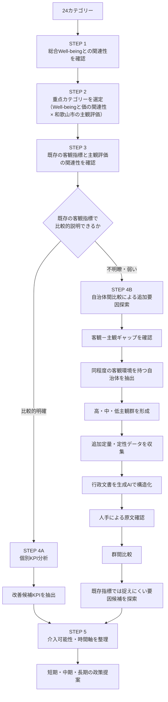

# 和歌山市におけるWell-being向上に向けた分析設計書

## 1．目的

本研究では、和歌山市の住民のWell-being向上に向けて、住民の主観的評価と客観的な地域環境の関係を分析し、Well-beingの向上につながる、またはつながる可能性のある要因を探索する。

特に、客観的な地域環境と主観的評価の関係が比較的明確な分野については、どの客観的指標を改善候補として検討すべきかを分析する。

一方で、既存の客観指標だけでは主観評価の差を十分に説明できない分野については、単純に「改善できない」と判断しない。客観環境が同程度であるにもかかわらず主観評価が異なる自治体を比較し、既存指標では捉えられていない追加的な定量・定性情報を収集することで、主観評価の差に関連する可能性のある要因を探索する。

これにより、

* 「どの分野を重点的に改善すべきか」
* 「その分野では、客観環境を改善することが有効なのか」
* 「それとも、既存の客観指標では捉えられていない要因を改善することが重要なのか」

を整理し、和歌山市における政策提案につなげる。

なお、本研究では、観察データを用いた分析から政策介入の因果効果を直接証明することを目的としない。統計的な関連が確認されたものは「改善候補」として扱い、自治体間比較から得られた差異については「主観評価の差に関連する可能性のある要因」として扱う。

---

## 2．データソース

### 2.1 地域幸福度（Well-Being）指標

デジタル庁「地域幸福度（Well-Being）指標」ダッシュボードを使用する。  
https://well-being.digital.go.jp/dashboard

都道府県・市区町村・年度を選択することで、主観的Well-beingおよび客観的Well-beingに関する指標を取得する。

#### スコア仕様
主観・客観ともに全国調査結果をもとに偏差値化されている。

* **平均：** 50
* **標準偏差：** 10

そのため、本研究では24カテゴリーを同一スケール上で比較する。

### 2.2 24カテゴリー

#### 生活環境（16カテゴリー）
1. 医療・福祉
2. 買物・飲食
3. 住宅環境
4. 移動・交通
5. 遊び・娯楽
6. 子育て
7. 初等・中等教育
8. 地域行政
9. デジタル生活
10. 公共空間
11. 都市景観
12. 自然景観
13. 自然の恵み
14. 環境共生
15. 自然災害
16. 事故・犯罪

#### 地域の人間関係（2カテゴリー）
17. 地域とのつながり
18. 多様性と寛容性

#### 自分らしい生き方（6カテゴリー）
19. 自己効力感
20. 健康状態
21. 文化・芸術
22. 教育機会の豊かさ
23. 雇用・所得
24. 事業創造

---

## 3．目的変数

本研究では、総合Well-beingを評価する指標として、住民の**生活満足度**を主たる目的変数とする。  
ただし、利用可能なデータの内容を確認した上で、総合Well-beingに関連する他の指標についても補助的に分析する可能性がある。

---

## 4．分析全体の考え方

本研究では、まず「何を重点的に調べるか」を決定し、その後に「なぜ主観評価が低いのか」を分析する。



# 分析ステップ一覧表

| STEP | 分析内容 | 主な目的 |
| :--- | :--- | :--- |
| **STEP 1** | 24カテゴリーと総合Well-beingの関連性確認 | 生活満足度と関連するカテゴリーを把握する |
| **STEP 2** | 重点カテゴリーの選定 | Well-beingとの関連性が高く、和歌山市の主観評価が低いカテゴリーを特定する |
| **STEP 3** | 既存の客観指標と主観評価の関連性確認 | 客観指標によって主観評価の差をどこまで説明できるか確認する |
| **STEP 4A** | 【ルートA】個別KPI分析 | 既存の客観指標との関連が比較的明確なカテゴリーについて、改善候補KPIを特定する |
| **STEP 4B** | 【ルートB】自治体間比較による追加要因探索 | 既存の客観指標だけでは説明しにくいカテゴリーについて、追加的な要因候補を探索する |
| **STEP 5** | 【ルートB】客観－主観ギャップの確認 | 客観環境と主観評価の乖離を把握する |
| **STEP 6** | 【ルートB】類似自治体の抽出 | 和歌山市と客観環境が同程度の自治体を抽出する |
| **STEP 7** | 【ルートB】高・中・低主観群の形成 | 同程度の客観環境における主観評価の違いを比較可能にする |
| **STEP 8** | 【ルートB】追加データの収集 | 既存指標では捉えられていない可能性のある情報を収集する |
| **STEP 9** | 【ルートB】生成AIによる行政文書の構造化 | 自治体ごとに異なる行政文書を共通項目に整理する |
| **STEP 10** | 【ルートB】生成AIの結果を人手で確認 | 抽出内容の正確性と原文との整合性を確認する |
| **STEP 11** | 【ルートB】追加データを統合した群間比較 | 高主観群と低主観群の特徴の違いを比較する |
| **STEP 12** | 【ルートB】主観評価の差に関連する要因候補の抽出 | 既存指標では捉えにくい要因候補を特定する |
| **STEP 13** | 【合流】要因の介入可能性評価 | 4Aの改善候補KPIと4Bの要因候補を短期・中期・長期等に整理する |
| **STEP 14** | 政策提案 | 分析結果を具体的な改善施策につなげる |
| **STEP 15** | 政策ロードマップの作成 | 短期・中期・長期の施策として整理する |
---

## 5．STEP 1：24カテゴリーと総合Well-beingの関連性確認

### 5.1 目的
24カテゴリーのうち、どのカテゴリーが生活満足度と関連しているのかを把握する。  
ここでは、「どのカテゴリーがWell-being上重要なのか」を明らかにする。

### 5.2 分析方法
全国自治体のデータを用い、24カテゴリーの主観指標と生活満足度との関連性を分析する。

まず、各カテゴリーと生活満足度について相関分析を行い、関連の方向と大きさを確認する。  
さらに、カテゴリー間の関係も考慮するため、必要に応じて24カテゴリーを同時に投入した重回帰分析を行う。

$$\text{LifeSatisfaction}_i = \beta_0 + \beta_1 X_{1i} + \cdots + \beta_{24} X_{24i} + \varepsilon_i$$

* $\text{LifeSatisfaction}_i$：自治体 $i$ の生活満足度
* $X_{ji}$：自治体 $i$ のカテゴリー $j$ の主観指標
* $\beta_j$：カテゴリー $j$ と生活満足度との関連の大きさ
* $\varepsilon_i$：モデルで説明できない部分

#### 主に確認する指標
* 標準化偏回帰係数
* $p$ 値
* 信頼区間
* 決定係数 ($R^2$)
* 多重共線性

重回帰係数は、「他のカテゴリーの違いを考慮した場合に、そのカテゴリーと生活満足度がどの程度関連しているか」を表す。  
ただし、これは因果効果ではなく、統計的な関連性として解釈する。

---

## 6．STEP 2：重点カテゴリーの選定

### 6.1 目的
STEP 1で得られたWell-beingとの関連性と、和歌山市の主観評価を組み合わせ、重点的に原因分析を行うカテゴリーを選定する。

### 6.2 選定軸
重点カテゴリーは、次の2軸を基本とする。

1. Well-beingとの関連性
2. 和歌山市の主観評価

客観指標は、この段階では重点カテゴリーを選定するための主要条件にはしない。  
理由は、「客観環境が悪いから重点」ではなく、「住民の実感が低く、かつ生活満足度との関連性が高いから重点」とするためである。

### 6.3 マトリクス

```
                    Well-beingとの関連性
                            高
                             ↑
          ┌──────────────────┼──────────────────┐
          │                  │                  │
          │ 重点検討領域     │ 最重点領域        │
          │                  │                  │
          │ 関連性が高く     │ 関連性が高く      │
          │ 主観も低い       │ 主観が特に低い    │
          │                  │                  │
──────────┼──────────────────┼──────────────────→
          │                  │                  │
          │ 優先度低         │ 維持・参考領域    │
          │                  │                  │
          │ 関連性が低く     │ 関連性が低く      │
          │ 主観も低い       │ 主観は高い        │
          │                  │                  │
          └──────────────────┴──────────────────┘
                            ↓
                         主観評価
                          低 → 高
```

特に、「Well-beingとの関連性が高い × 和歌山市の主観評価が低い」カテゴリーを重点的に分析する。

---

## 7．STEP 3：既存の客観指標と主観評価の関連性確認

### 7.1 目的
重点カテゴリーについて、「現在利用している客観指標によって、主観評価の違いをどの程度説明できるのか」を確認する。  
ここが、その後の分析方法を分岐させるポイントである。

### 7.2 なぜ必要なのか
同じ「主観評価が低い」という結果でも、その背景は異なる可能性がある。

* **ケースA：** 客観指標が低い $\rightarrow$ 主観評価も低い（客観環境の不足が主観評価の低さと関連している可能性がある）
* **ケースB：** 客観指標は一定水準 $\rightarrow$ 主観評価は低い（現在の客観指標だけでは主観評価の低さを十分に説明できない可能性がある）

したがって、主観評価が低い理由を、まず既存の客観指標からどこまで説明できるかを確認する。

### 7.3 分析方法
重点カテゴリーについて、全国自治体データを用いて、

$$\text{Subjective}_i = \beta_0 + \beta_1 \text{Objective}_i + \varepsilon_i$$

などのモデルにより、客観指標と主観評価の関連性を確認する。

複数年度のデータが十分に利用可能な場合には、

$$\text{Subjective}_{it} = \beta_0 + \beta_1 \text{Objective}_{it} + \alpha_i + \delta_t + \varepsilon_{it}$$

のようなパネルモデルも検討する。

* $\alpha_i$：自治体固有の時間不変要因
* $\delta_t$：年度共通の要因

ただし、利用可能な年度数や客観指標の更新状況を確認した上で採否を決定する。

### 7.4 「説明できる／できない」の判断
ここでは、「$R^2 \ge 0.5$ なら説明可能」のように、単一の閾値だけで機械的に分類しない。以下を総合的に確認する。

* 相関係数
* 回帰係数
* $R^2$
* 信頼区間
* 残差
* 複数年度での再現性
* モデルの妥当性

最終的には、以下の2つに整理する。
* 既存の客観指標との対応が比較的明確
* 既存の客観指標だけでは十分に説明できない

この分類は、「客観指標が効く／効かない」という因果判定ではない。

---

## 8．STEP 4A：既存の客観指標との関連が比較的明確な場合

### 8.1 目的
重点カテゴリーの主観評価と客観指標に一定の関連が確認された場合、そのカテゴリーを構成する個別KPIまで掘り下げる。

### 8.2 分析方法
重点カテゴリーの主観指標を目的変数、同カテゴリーの個別KPIを説明変数として分析する。

例えば、

```
医療・福祉
 ├─ 医療機関数
 ├─ 医師数
 ├─ 病床数
 ├─ 夜間診療体制
 └─ その他の個別KPI
```

などに分解する。

KPI数が多い場合には、Lasso回帰やElastic Net等を用いた変数選択を検討する。

$$\text{Subjective}_i = \beta_0 + \sum_{k=1}^{p}\gamma_k \text{KPI}_{ki} + \varepsilon_i$$

Lassoでは、

$$\min_{\gamma} \left[ \frac{1}{2n}\sum_{i=1}^n (y_i - \hat{y}_i)^2 + \lambda \sum_{k=1}^p |\gamma_k| \right]$$

のように係数へペナルティを与え、一部の係数を0にすることで候補KPIを絞り込む。

### 8.3 変数選択の確認
Lassoの結果だけで重要KPIを決定せず、以下を確認する。

* クロスバリデーション
* 選択されたKPIの安定性
* Elastic Netとの比較
* 多重共線性
* 係数の符号

### 8.4 出力
最終的に、「主観評価の改善を検討する上で、統計的な関連が比較的明確なKPI」を改善候補として抽出する。  
ただし、「KPIを改善すれば主観評価が必ず上がる」とは結論づけず、「このKPIの改善を政策上の候補として検討する根拠がある」という位置づけにする。

---

## 9．STEP 4B：既存の客観指標との関連が不明瞭・弱い場合

### 9.1 目的
既存の客観指標と主観評価の関連が弱い場合、「既存の客観指標だけでは捉えられていない要因が主観評価の差に関係している可能性」を検討する。

ここでは、未知の要因を最初から特定の「潜在変数」として仮定しない。  
まず、「同程度の客観環境なのに、なぜ自治体によって主観評価が違うのか」を比較する。

---

## 10．STEP 5：客観－主観ギャップの確認

### 10.1 定義

$$\text{Gap}_i = \text{Subjective}_i - \text{Objective}_i$$

値がマイナスで大きいほど、客観指標に対して主観評価が低い。

### 10.2 ギャップの役割
ギャップを、「大きいほど改善可能」とは解釈しない。  
STEP 4Bでは、「客観環境が同程度でも主観評価が異なる自治体を探すための補助情報」として利用する。

例えば、

| 自治体 | 客観 | 主観 | ギャップ |
| :--- | :--- | :--- | :--- |
| **和歌山市** | 70 | 43 | -27 |
| **A市** | 69 | 62 | -7 |
| **B市** | 71 | 64 | -7 |

のような場合、「客観環境はほぼ同じなのに主観評価に大きな差がある」ことを確認できる。

---

## 11．STEP 6：同程度の客観環境を持つ自治体を抽出

### 11.1 目的
和歌山市と客観環境が近い自治体を全国から抽出し、「同じような客観環境でも、なぜ主観評価が異なるのか」を比較する。

### 11.2 抽出方法
基本的には重点カテゴリーの客観指標を基準とする。  
例えば、和歌山市の客観偏差値が70の場合、

$$|\text{Objective}_i - \text{Objective}_{\text{Wakayama}}| \le \delta$$

となる自治体を候補とする。ここで $\delta$ は候補自治体数と指標分布を確認した上で設定する。

必要に応じて、以下なども検討する。
* ユークリッド距離
* 標準化距離
* マハラノビス距離

ただし、比較する客観指標が少ない場合は、過度に複雑な手法を用いず、偏差値の近接条件による抽出を基本とする。

### 11.3 人口・地理等の扱い
人口・地理・交通等は、最初の類似自治体の抽出条件に必ずしも含めない。  
これらは、「主観評価の差を生み得る追加的な要因」として、自治体抽出後に比較する。

---

## 12．STEP 7：高・中・低主観群の形成

### 12.1 目的
同程度の客観環境を持つ自治体の中で、「主観評価の高い自治体と低い自治体では何が異なるのか」を比較する。

### 12.2 方法
抽出された自治体を、重点カテゴリーの主観評価に基づいて以下の3群に分ける。

* 高主観群
* 中間群
* 低主観群

例えば、候補自治体が30自治体の場合、
* **高主観群：** 上位10自治体
* **中間群：** 中位10自治体
* **低主観群：** 下位10自治体

などとする。具体的な自治体数は、データ分布と行政資料の収集可能性を踏まえて決定する。

### 12.3 意味
これは、「成功自治体／失敗自治体」を判定するものではない。  
あくまで、「同程度の客観環境における主観評価の違いを比較するためのグループ化」である。

---

## 13．STEP 8：既存指標では捉えられていない追加データの収集

ここが、本研究の重要な特徴の一つである。  
Well-beingダッシュボード等の既存客観指標では、以下の要素が十分に捉えられていない可能性がある。

* 情報の届き方
* サービスの使いやすさ
* 予約のしやすさ
* 市民参加のしやすさ
* 実際のアクセス性
* 行政運用

そこで、STEP 7で形成した各自治体群について、追加的な定量・定性情報を収集する。

### 13.1 人口・地域特性
* 人口
* 人口密度
* 高齢化率
* 可住地面積
* 年齢構成
* 昼夜間人口比率

### 13.2 地理・アクセス
* 公共交通
* 駅・バス停へのアクセス
* 施設への移動時間
* 施設配置
* 移動手段

### 13.3 施設・サービスの利用条件
* 開館時間
* 休館日
* 利用料金
* 予約方法
* オンライン予約
* 利用可能時間

### 13.4 行政運用
* 情報発信
* LINE・SNS
* Webサイト
* 情報の一元化
* 市民参加
* 民間・地域団体との連携

### 13.5 地域固有条件
* 歴史
* 文化
* 生活習慣
* 地域特性

---

## 14．STEP 9：生成AIによる行政文書の構造化

### 14.1 目的
自治体ごとに文章の形式や表現が異なるため、行政文書をそのまま比較することは難しい。  
そこで生成AIを利用し、各自治体の行政文書から、あらかじめ設定した共通項目に沿って情報を抽出・構造化する。

### 14.2 対象文書
* 総合計画
* 地方創生関連計画
* 分野別計画
* DX推進計画
* 文化振興計画
* 公共交通計画
* 公式Webサイト
* 公式SNS・LINE
* 事業資料
* 施設利用案内
* 予約システム

### 14.3 共通の抽出観点

| 比較項目 | 主な確認内容 |
| :--- | :--- |
| **情報発信** | LINE・SNS・Web等の活用 |
| **利用のしやすさ** | 予約・申請・利用方法 |
| **利用時間** | 夜間・休日対応 |
| **市民参加** | ワークショップ・協働事業 |
| **民間連携** | 民間・地域団体との協働 |
| **デジタル活用** | オンライン化・データ活用 |
| **施設運営** | 運営方法・利用者視点の改善 |

生成AIの役割は、「行政文書から新しい事実を生成すること」ではなく、「既存文書の内容を自治体間で比較可能な構造へ変換すること」とする。

---

## 15．STEP 10：生成AIの結果を人手で確認

生成AIが抽出した情報を、そのまま研究結果として利用しない。  
行政文書の原文を確認し、以下を確認・修正する。

* 誤抽出
* 文脈の誤解
* 過度な一般化
* 計画段階と実施済み施策の混同
* 実際には存在しない施策の生成

分析は、以下の手順で行う。

```
行政文書 ──> 生成AIによる構造化 ──> 人手による原文確認 ──> 確定データ
```

---

## 16．STEP 11：追加データを統合して群間比較

### 16.1 目的
STEP 8～10で収集・構造化した追加データを統合し、「既存の客観環境が同程度なのに、高主観群と低主観群では何が違うのか」を比較する。

### 16.2 データを一律に2値分類しない
追加データは、その性質に応じた尺度で扱う。

| 要因 | データの扱い |
| :--- | :--- |
| **人口密度** | 連続値 |
| **高齢化率** | 連続値 |
| **移動時間** | 連続値 |
| **公共交通** | 連続値・順序尺度 |
| **オンライン予約** | 2値・実施率 |
| **情報発信** | 順序尺度 |
| **市民参加** | 順序尺度 |
| **施設配置** | 連続値・空間指標 |

必要に応じて、以下を利用する。
* 平均値
* 中央値
* 効果量
* 群間検定
* 箱ひげ図
* 散布図

比較対象自治体数が少ない場合は、検定の有意性だけで判断せず、差の大きさと複数自治体での共通性を重視する。

### 16.3 比較マトリクス

| 要因候補 | 高主観群 | 中間群 | 低主観群 | 群間で確認された傾向 |
| :--- | :--- | :--- | :--- | :--- |
| **情報発信** | 2.8 | 1.9 | 1.2 | 高主観群で高い |
| **オンライン予約** | 80% | 40% | 20% | 高主観群で多い |
| **市民参加** | 2.6 | 1.8 | 1.3 | 高主観群で高い |
| **公共交通** | 4.2 | 3.1 | 2.0 | 高主観群で高い |
| **施設配置** | 5.8 | 5.5 | 5.3 | 大きな差なし |
| **平地率** | 52% | 55% | 51% | 大きな差なし |

これにより、「既存の客観指標が同程度であるにもかかわらず、高主観群と低主観群で異なる特徴は何か」を確認する。

---

## 17．STEP 12：主観評価の差に関連する要因候補の抽出

STEP 11の結果から、以下のような特徴を持つ要因を抽出する。

* 高主観群で共通して確認される
* 低主観群では少ない
* 群間差が比較的大きい
* 複数自治体で確認される

これらを、「主観評価の差に関連する可能性のある要因候補」として整理する。

#### 判断例①：情報発信
```
高主観群：8/10
低主観群：2/10
   ↓
群間差が大きい
   ↓
「情報発信」が要因候補
```

#### 判断例②：施設配置
```
高主観群：6/10
低主観群：5/10
   ↓
群間差が小さい
   ↓
主観評価の差を説明する要因候補としては弱い
```

ただし、「差がある = 原因である」とは解釈しない。  
あくまで、「既存の客観指標では説明されなかった主観評価の差と関連する可能性がある」という位置づけとする。

---

## 18．STEP 13：要因の介入可能性を評価

STEP 4Aで抽出した改善候補KPIと、STEP 12で抽出した要因候補について、行政が介入可能か、介入に必要な期間はどの程度かを整理する。

### 18.1 短期的に介入しやすい要因
* 情報発信
* Web・LINE
* オンライン予約
* UI/UX
* 利用案内
* 市民参加の仕組み

### 18.2 中長期的に介入可能な要因
* 公共交通
* 施設配置
* 都市構造
* アクセス環境
* 行政サービスの再設計

### 18.3 直接的な変更が困難な要因
* 地形
* 気候
* 歴史
* 地域固有の文化
* 生活習慣

これらは、「改善対象」ではなく、**政策設計上の前提条件**として扱う。

なお、これはカテゴリー単位の分類ではなく、同一カテゴリー内に複数の介入レベルの要因が存在することを前提とする。

```
文化・芸術
 ├─ 情報発信      → 短期
 ├─ 予約方法      → 短期
 ├─ 公共交通      → 中長期
 ├─ 施設配置      → 長期
 └─ 歴史・文化    → 直接変更困難
```

---

## 19．STEP 14：政策提案

### 19.1 ルートA：既存KPIとの関連が比較的明確

```
個別KPI ──> 主観評価との関連 ──> 改善候補KPI ──> 介入可能性・実現性 ──> 具体的施策
```

例えば、「特定KPIと主観評価の関連が確認され、和歌山市の水準が低い」場合、そのKPIの改善を政策上の候補として検討するという提案につなげる。

### 19.2 ルートB：既存KPIでは説明困難

```
客観－主観ギャップ ──> 同程度の客観環境を持つ自治体 ──> 高・中・低主観群 ──> 追加定量・定性情報 ──> 群間比較 ──> 要因候補 ──> 介入可能性 ──> 具体的施策
```

例えば、「客観環境は同程度だが、高主観群では情報発信・オンライン予約・市民参加が共通して確認された」場合、既存施設の追加整備だけでなく、情報発信・利用促進・市民参加等の運用改善を優先するという方向性を提案する。

ただし、「情報発信が主観評価を上げることが証明された」とは表現しない。  
「情報発信が主観評価の差に関連する可能性があり、政策上の改善候補として検討する」とする。

---

## 20．STEP 15：短期・中期・長期の政策ロードマップ

| 時間軸 | 主な対象 | 施策例 |
| :--- | :--- | :--- |
| **短期** | 情報・運用・利用促進 | LINE、Web、予約UI、利用案内 |
| **中期** | サービス・制度 | データ連携、市民参加、公共交通連携 |
| **長期** | 都市・インフラ | 交通網、施設配置、都市構造 |

これにより、「今すぐ実施できる施策」「数年かけて実施する施策」「長期的な都市政策として取り組む施策」を区別して提示する。

---

## 21．スマートシティへの接続

本研究では、スマートシティを単なるデジタル化として扱わない。  
分析によって明らかになった課題に対して、「データ・デジタル技術を活用し、既存の地域資源を住民の実感につなげる」という観点からスマートシティ施策を検討する。

```
既存の地域資源
      ↓ （情報が届きにくい / 利用しにくい / 参加しにくい）
データ・デジタル技術
      ↓ （情報発信・予約・参加・行政サービスの改善）
住民の実感向上
      ↓
Well-being向上
```

という流れで分析結果と政策を接続する。

---

## 22．分析結果の解釈ルール

本研究では、結果の根拠の強さを明確に区別する。

| 分析結果 | 解釈 | 政策への利用 |
| :--- | :--- | :--- |
| **客観KPIと主観評価の関連が比較的明確** | 客観環境と主観評価の対応が確認された | 改善候補KPIとして提示 |
| **既存KPIでは説明しにくいが自治体間で差が確認された** | 追加要因が関係している可能性 | 要因候補として提示 |
| **群間差が小さい** | 明確な要因を確認できない | 優先度を下げる |
| **データが不足している** | 現時点では判断困難 | 追加調査を検討 |

特に、「統計的に関連が確認されたもの」と「自治体間比較から可能性が示されたもの」を同じ証拠の強さとして扱わないことを徹底する。

---

## 23．期待される成果

### 23.1 重点分野の明確化
生活満足度との関連性が高く、和歌山市の主観評価が低いカテゴリーを特定する。

### 23.2 改善候補KPIの特定
既存の客観指標と主観評価の関連が比較的明確な分野について、個別KPIまで掘り下げ、改善候補を特定する。

### 23.3 既存指標では捉えられない要因の探索
既存客観指標と主観評価の関連が弱い分野について、同程度の客観環境を持つ自治体を比較し、以下の追加的な要因候補を探索する。

* 情報発信
* 利用のしやすさ
* 市民参加
* サービス設計
* 行政運用
* アクセス環境

### 23.4 実行可能な政策ロードマップ
抽出した候補を「短期」「中期」「長期」に整理し、和歌山市が実際に取り組むための政策ロードマップを提示する。
