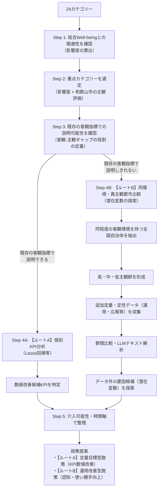

# 和歌山市のWell-being向上に向けた分析設計書

## 1. 目的

本研究では、和歌山市の住民のWell-being向上に向けて、住民の主観的評価と客観的な地域環境の関係を分析し、Well-beingの向上につながる、もしくはつながる可能性のある要因を探索する。

特に、客観的な地域環境を改善することで主観的評価の改善が期待できる分野だけでなく、既存の客観指標では説明しきれない主観評価の差にも着目する。

これにより、

> 「何を改善すれば住民のWell-being向上につながるのか」
>
> 「既存の客観指標では説明できない場合、どのような要因が主観評価の差に関係している可能性があるのか」

を明らかにすることを目指す。

なお、本研究では、横断的なデータ分析から政策の因果効果を直接証明することを目的としない。

統計的に関連が確認できる要因については「改善候補」として扱い、既存指標では説明が困難な場合には、追加的な定量・定性的データを用いて「主観評価の差に関連する可能性のある要因」を探索する。

---

## 2. データソース

### 2.1 地域幸福度（Well-Being）指標

デジタル庁「地域幸福度（Well-Being）指標」ダッシュボードを使用する。

https://well-being.digital.go.jp/dashboard

都道府県・市区町村・年度を選択することで、主観的Well-beingおよび客観的Well-beingに関する指標を取得する。

#### スコア仕様

主観・客観ともに全国調査結果をもとに偏差値化されている。

- 平均：50
- 標準偏差：10

そのため、24カテゴリーは同一スケール上で比較することができる。

---

### 2.2 24カテゴリー

#### 生活環境（16カテゴリー）

1. 医療・福祉
2. 買物・飲食
3. 住宅環境
4. 移動・交通
5. 遊び・娯楽
6. 子育て
7. 初等・中等教育
8. 地域行政
9. デジタル生活
10. 公共空間
11. 都市景観
12. 自然景観
13. 自然の恵み
14. 環境共生
15. 自然災害
16. 事故・犯罪

#### 地域の人間関係（2カテゴリー）

17. 地域とのつながり
18. 多様性と寛容性

#### 自分らしい生き方（6カテゴリー）

19. 自己効力感
20. 健康状態
21. 文化・芸術
22. 教育機会の豊かさ
23. 雇用・所得
24. 事業創造

---

## 3. 目的変数

本研究では、総合Well-beingを評価する指標として、住民の**生活満足度**を主たる目的変数とする。

ただし、分析の進行に伴い、総合Well-beingに含まれる他の指標についても分析対象とする可能性がある。

---

## 4. 分析ステップの全体像（概要サマリー）

本分析では、「何に取り組むか（重点カテゴリー選定）」を**主観軸**で決定したのち、「どう解決するか」を**既存客観指標での説明可能性（ルートA/B）**で分岐させる構造をとる。



### 全Stepの要約一覧

| Step | 名称 | 主な分析内容・判断基準 |
| :--- | :--- | :--- |
| **Step 1** | **総合Well-beingとの関連性確認** | 24カテゴリーから生活満足度に与える影響度（係数 $\beta$）を算出 |
| **Step 2** | **重点カテゴリーの選定** | **「影響度（高）」×「和歌山市の主観（低）」** で最優先改善領域を抽出 |
| **Step 3** | **説明力の判定とギャップの役割定義** | 決定係数 $R^2$ で判定。ルートAとBで客観-主観ギャップの解釈を明確に切り分ける |
| **Step 4A** | **【ルートA】個別KPI分析** | 既存KPIから主観向上に直結するキラーKPIを特定し定量目標を設定（Lasso回帰） |
| **Step 4B** | **【ルートB】潜在変数の探索** | 客観数値が近い他都市を抽出し、主観の差を生む運用・広報・UI等の潜在変数を探索 |
| **Step 5** | **時間軸整理と政策提言** | 定量改善と運用改善の施策を介入可能性と時間軸（短・中・長期）で整理 |

---

## 5. 詳細な分析プロセスの設計

### 5.1 Step 1：総合Well-beingと24カテゴリーの関連性確認
和歌山市および全国自治体のデータを用い、24カテゴリーの主観スコアが総合Well-being（生活満足度）にどの程度影響を与えているかを定量的に把握する。

* **分析手法：** 相関分析、重回帰分析（目的変数：生活満足度、説明変数：24カテゴリーの主観スコア）
* **アウトプット：** 各カテゴリーの影響度（回帰係数 $\beta$）の算出
* **目的：** 住民の生活満足度を押し上げるテコ（インパクト）が大きいカテゴリーを把握する。

---

### 5.2 Step 2：重点カテゴリーの選定（影響度 × 主観評価）
Step 1で得られた「総合Well-beingへの影響度」と、「和歌山市の主観スコア」の2軸で24カテゴリーをマトリクス配置し、**「改善した際の影響が大きいにもかかわらず、現在住民の満足度が低い領域」** を最優先の重点カテゴリーとして特定する。

```
                    【総合Well-beingへの影響度】
                     高 (テコの原理が効く)
                        │
     【最優先改善領域】 │ 【強み維持・伸長領域】
    ・影響度が大きく、  │ ・影響度が大きく、
      住民満足度が低い  │   住民満足度も高い
  ──(主観：低)─────────┼─────────(主観：高)───【和歌山市の主観スコア】
    ・影響度が小さく、  │ ・影響度は小さく、
      住民満足度が低い  │   住民満足度は高い
     【優先度：低】     │ 【維持領域】
                        │
                     低 (影響が薄い)
```

* **選定軸の考え方：** 住民にとっての真の課題は「住民の実感（主観）が低いこと」にあるため、ここでは客観指標を混ぜず、純粋に「主観」と「影響度」のみで取り組むべき優先テーマを決定する。
* **選定領域：** マトリクス左上の**「最優先改善領域」**に該当するカテゴリーをStep 3に進める。

---

### 5.3 Step 3：既存客観指標での説明可能性判定と「ギャップ」の役割定義
選定された重点カテゴリーにおいて、**「既存の客観指標（統計・インフラデータ等）で主観評価の低さをどこまで説明できるか」** を検証（決定係数 $R^2$ を確認）し、客観－主観ギャップの解釈を2つのルートへ切り分ける。

```
                          主観が低い
                             │
            既存の客観指標との関係（R²）を確認
                             │
            ┌────────────────┴────────────────┐
            ↓                                 ↓
【ルートA】比較的説明できる          【ルートB】説明しきれない
 (客観値の低いことが原因)           (データ外の潜在変数が影響)
```

* **ルートA（既存指標で説明可能な場合）：**
  * **ギャップの解釈：** **「客観環境（インフラ・数値）の不足余地」** と捉える。
  * **ロジック：** 客観数値が低いことが主観の低さに直結しているため、客観数値（既存KPI）を引き上げることが直接的な改善策となる。
* **ルートB（既存指標で説明困難な場合）：**
  * **ギャップの解釈：** **「同じ客観環境下における運用・サービス面の差」** と捉える。
  * **ロジック：** 単に「ギャップが大きいから改善可能」とするのではなく、「なぜ客観環境が同等なのに自治体によって主観評価が違うのか？」というベンチマーク比較を行うための探索条件としてギャップを活用する。

---

### 5.4 Step 4A：【ルートA】個別KPI分析（定量数値改善アプローチ）
既存データとの連動性が高いカテゴリーについては、カテゴリーを構成する個別客観KPI（全国データベース内の最大208本）の中から、主観評価の引き上げに直接効くキラーKPIを特定する。

* **分析手法：** **Lasso回帰分析**（多重共線性を回避し、有効な変数を自動選定）
* **モデル式：**
  $$\text{主観スコア} = \sum_{k} \gamma_k \times \text{客観個別KPI}_k + \text{統制変数} + \varepsilon$$
* **アウトプット：** 「客観指標 $X$ の数値を $Y$ まで改善することで主観評価向上を図る」という具体的な定量目標の設定。

---

### 5.5 Step 4B：【ルートB】同環境・異主観都市の比較分析（潜在変数探索アプローチ）
既存の客観指標と主観の連動性が低い分野（例：都市景観、寛容性、行政など）では、統計データに出てこない運用面の工夫や心理的ハードル（潜在変数）を探る。

* **分析手順：**
  1. **同環境都市の抽出：** 和歌山市と客観環境スコアが同等水準の自治体（例：客観スコア70前後の都市群）を全国から抽出する。
  2. **比較群（高主観 vs 低主観）の形成：** 同環境群の中で、主観評価が高い都市（例：主観65以上）と低い都市（例：和歌山市を含む主観45以下）に分類する。
  3. **定性データの収集・比較：** 行政計画書、広報誌、予約システムUI、市民参加プログラム、アクセス性等の定性データを収集し、LLM等を用いてテキスト比較を行う。
* **探求する潜在変数の例：**
  * 情報発信・認知度
  * サービスの利用しやすさ・UI/UX
  * 予約手続きの簡便さ
  * 市民参加のハードルの低さ
  * 施設配置や心理的・時間的アクセス
* **アウトプット：** 既存指標に存在しない運用・プロセス面の改善アイディアの特定。

---

### 5.6 Step 5：介入可能性・時間軸の整理と政策提言
ルートA・ルートB双方で得られた改善候補・要因を、自治体が実行可能か（介入可能性）および達成に必要な期間（時間軸）で整理し、実現性の高い政策パッケージを構築する。

```
                    【介入可能性】
                     高 (自治体で制御可能)
                        │
      [短期施策]        │        [中長期施策]
    ・広報・認知向上    │      ・インフラ整備
    ・UI/UXの改善       │      ・大型施設誘致
  短 ───────────────────┼─────────────────── 長 【時間軸】
    ・地域コミュニティ  │      ・住民意識の醸成
      の場づくり        │      ・シビックプライド向上
                        │
                     低 (環境・地理要因等)
```

#### 政策提案の２つのパターン
* **【ルートA由来】定量目標型施策（ハード・整備系）：**
  * 客観KPIの数値を直接引き上げるための予算配分やインフラ整備施策。
* **【ルートB由来】プロセス・運用改善型施策（ソフト・活用系）：**
  * 数値上のインフラ整備ではなく、認知向上、使い勝手（UI/UX）の向上、市民参加の促進などの運用改善施策。

---

## 6. 期待される成果・提供価値

1. **根拠に基づく予算配分（EBPMの実現）：** 住民の生活満足度に寄与しない領域への重複投資を防ぎ、真にインパクトのある分野へリソースを集中できる。
2. **「数値に出てこない課題」の可視化：** 従来の統計データ分析では切り捨てられていた「運用の良し悪し」や「心理的ハードル」を政策課題として拾い上げることができる。
3. **実現可能なロードマップの策定：** 即効性のある短期施策（広報・運用改善）と、持続的な中長期施策（インフラ・都市計画）を分けて提示することで、自治体現場が動きやすい提案を実現する。　
